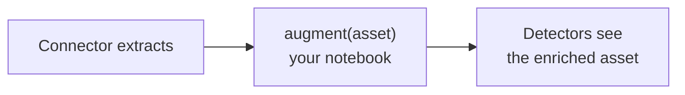

import { Callout } from "nextra/components";

# Source Augmentation

Every known source extracts exactly what its connector was written to extract —
no more. When you want to *add* something — precompute a join key, look a value
up in another system, assert a fact you already know as a tag, or draw a lineage
edge to an asset another source owns — augmentation is the place. It is an
optional Python notebook attached to **any** source that runs per asset, after
extraction and before detection.

---

## Augmentation vs detectors vs custom connectors

| You want to… | Reach for… |
|---|---|
| Find something **in the content** (a pattern, an entity, a judgement call) | A [detector](/detectors/) |
| Assert something the **source system already knows** (a classification, a hold flag, an owner) | **Augmentation** — `asset.tag(...)` |
| Compute a value from the asset for **joins and grouping** | **Augmentation** — `asset.set(...)` |
| Draw **lineage** from an asset another source owns | **Augmentation** — `yield flow(...)` |
| Replace extraction itself (a new system, a new API, a new file layout) | A [custom connector](/sources/custom-connectors/) |

The rule of thumb: if the answer is in the content, detect it. If the answer is
*around* the content — in another system, in your head, in the relationship
between two assets — augment it.

---

## The additive-only guarantee

An augmentation notebook may only **add**:

- metadata under `metadata["augmentation"]` — never touching connector keys,
- tags, each resolved by a Tag detector,
- links to other assets by hash,
- a URN, and only when the connector left it empty,
- relationship edges, yielded exactly as a custom connector yields them.

It cannot change what the connector extracted, cannot drop an asset, and cannot
fail a scan. Anything outside that shape is ignored with a warning.

---

## What happens when it fails

Every failure mode degrades to the same place: a scan **warning**, and the asset
proceeds exactly as if augmentation were disabled.

- The notebook raises on an asset → warning, asset ingested unchanged.
- One asset takes longer than `per_asset_timeout_seconds` (default 30s) →
  warning, asset ingested unchanged.
- The child fails to start, packages fail to install, or a patch is malformed →
  warning, assets ingested unchanged.
- Failures repeat (`max_consecutive_failures`, default 10) → the session
  disables itself for the rest of the run and warns once, so a systematically
  broken notebook cannot drown the run log one warning per asset.

The run summary counts augmented assets, failures, tags asserted and edges, so
a silently-degraded run stays visible.

<Callout type="info">
  Editing the notebook invalidates the scan cache automatically: the notebook
  revision rides in the cache signature, so a code change re-augments cached
  assets instead of silently skipping them.
</Callout>

---

## Throughput cost

Augmentation itself is one child process per run (more with `max_workers`, up to
8). The cost to watch is `asset.payload()`: on a warehouse it re-reads the row,
on object storage it downloads the bytes. It is lazy — paid only when called —
memoized per asset, and shared with the pipeline so the bytes are not fetched
twice. If the extracted text answers your question, prefer `asset.text()`.

| Limit | Default | What it bounds |
|---|---|---|
| `timeout_seconds` | 900 | A whole augmentation execution |
| `per_asset_timeout_seconds` | 30 | One `augment(asset)` call |
| `max_payload_bytes` | 32 MiB | One lazy payload fetch |
| `max_workers` | 1 | Parallel augmentation processes |
| `max_consecutive_failures` | 10 | Failures before the circuit breaker trips |

Recipes (connector notebook plus augmentation notebook together) must fit the
128 KB compressed recipe budget — augmentation notebooks are capped at 50 cells
to keep headroom.

---

## Debugging loop

While writing helpers, `cell` and `all` run the notebook with the augmentation
vocabulary bound and no asset — ordinary `print()` debugging. When the logic is
ready, **Run sample** (`preview_augment`) runs `setup()` / `augment()` /
`finalize()` over a random sample of the real connector's assets (5 by default,
up to 25) and reports per-asset diffs: metadata added, tags asserted and whether
each key matches a live Tag detector, links added, edges yielded. No sink, no
run record, no ingestion — read-only.

The full contract — `augment()` / `setup()` / `finalize()`, the `asset` and
`ctx` surfaces, lazy payload shapes per source family, and the troubleshooting
table — is on the **[Notebook Reference](./augmentation/reference/)** page.
