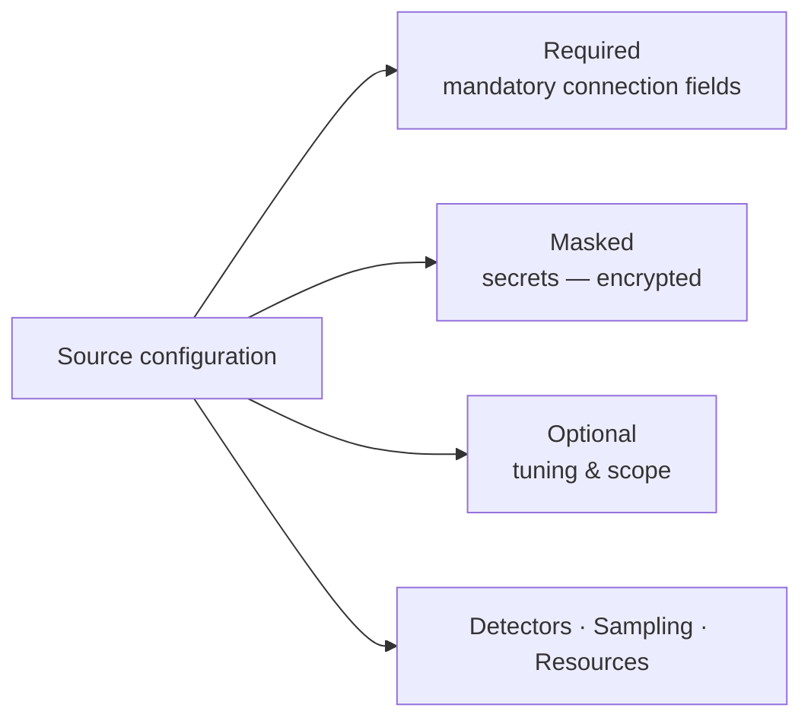
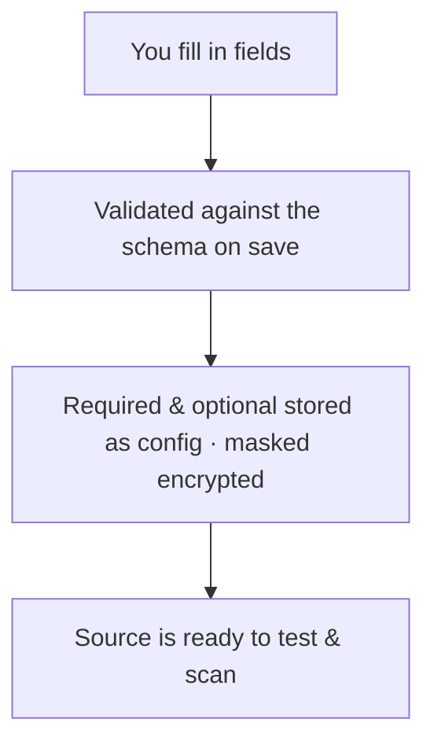

# Configuration & Fields

When you configure a source, its fields are organised into clear groups. Knowing
what each group means makes every source's reference page easy to read — and
tells you which values are mandatory, which are secret, and which you can safely
leave alone.

---

## Required fields (mandatory)

**Required** fields are the minimum needed to reach the system — the things
without which a scan simply cannot start. A workspace URL, a host and database
name, a list of channels: these are the non-secret coordinates of *where* to
connect.

- They are **validated** the moment you save: the configuration is checked
  against the source's schema, and you'll get a clear error if something's
  missing or the wrong shape.
- Some sources require **one of several** fields rather than a single fixed one
  (for example, a YouTube source needs *either* channels *or* video URLs). The
  per-source page calls these out.

Every source's reference page has a **Required Fields** table listing exactly
what it needs.

---

## Masked fields (secrets)

**Masked** fields hold sensitive credentials — API tokens, passwords, secret
keys. They are treated differently from everything else because they must never
leak:

| Behaviour | What it means for you |
|---|---|
| **Encrypted at rest** | Secrets are stored encrypted, not as plain text. |
| **Write-only** | You can set or replace a secret, but the full value is never sent back to the screen. |
| **Masked preview** | After saving, you see only a short preview (such as the first and last few characters) so you can recognise it without exposing it. |
| **Leave blank to keep** | When editing a source, leaving a masked field empty keeps the existing secret — you don't have to re-enter it. |

Because they're write-only, the way to confirm a credential actually works is to
**[test the connection](/sources/testing/)** rather than to re-read the value.

Each source's reference page has a **Masked Fields** table for its specific
secrets.

---

## Optional fields (tuning & scope)

**Optional** fields tune the scan for a particular system: scoping which content
to include, setting filters and limits, adjusting timeouts, or enabling
source-specific behaviour. They all have defaults, so you can start with none of
them and refine later.

Typical examples you'll see across sources:

- **Scope filters** — restrict to certain projects, folders, labels, or
  conversation types.
- **Size and rate limits** — skip very large attachments, or slow down API calls
  to respect rate limits.
- **Proxy / network options** — route traffic through a proxy when scanning at
  scale.

The per-source **Optional Fields** table documents each one, its default, and any
constraints.

---

## Detectors

Alongside the connection, a source declares **which detectors run** on the
content it ingests — built-in packs (PII, secrets, security, and more) and any
**custom detectors** you've built. Detectors are what turn raw content into
findings.

Detectors have their own section: see **[Detectors](/detectors/)** for the full
catalog and how to build custom ones. The [Config and Detector agents](/investigations/autopilot/agents/)
can even tune and author these for you automatically.

---

## Resources (advanced)

For demanding scans you can override the **compute resources** a source uses:

| Setting | Purpose |
|---|---|
| **CPU / memory requests & limits** | Reserve or cap the compute for a scan. |
| **Timeout** | Maximum runtime before a scan is stopped. |
| **Parallelism** | How many items are processed at once. |

Leave these unset unless you're scanning very large systems or running on
constrained infrastructure — Classifyre sizes sensible defaults automatically.

---

## How it all fits together

Two parts are mandatory for every source — the **required** connection fields and
a **[sampling](/sources/sampling/)** strategy. Everything else is optional with
defaults.

Next: decide how much data each scan reads in
**[Sampling Strategies](/sources/sampling/)**.
