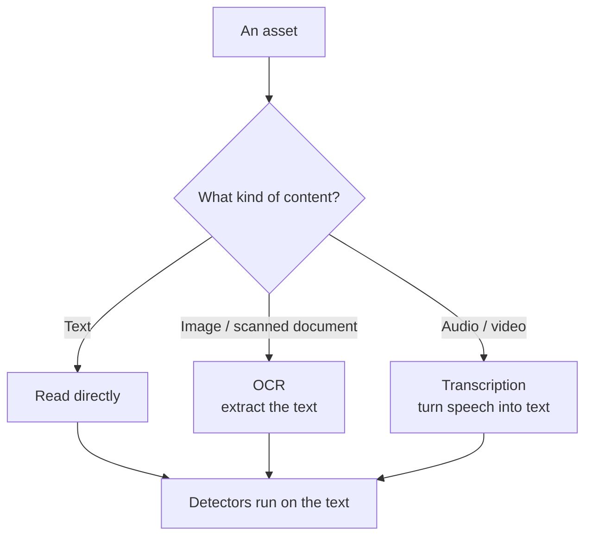

# OCR & Transcription

Detectors work on **text**. A lot of important content, though, isn't text to
begin with — it's locked inside scanned PDFs, screenshots, images, and audio or
video files. Two optional switches let Classifyre unlock that content so your
detectors can see it.

By default both are **off**: Classifyre reads the text that's already text and
leaves the rest as metadata-only. Turn these on per source when there's value
hidden in non-text content.

---

## OCR — read images and documents

**OCR** (Optical Character Recognition) extracts readable text from images and
supported binary documents before the text-capable detectors run.

**Turn it on when** a source holds content like:

- Scanned PDFs and faxes
- Screenshots and photos of documents
- Images that may contain text (whiteboards, ID cards, forms)

With OCR on, a screenshot that contains a leaked API key or a scanned form with
personal data becomes searchable by your detectors — instead of slipping through
as "just an image."

> **Trade-off:** OCR does extra work per image, so scans take a little longer.
> Enable it on sources where image content genuinely matters, and leave it off
> where everything is already text.

---

## Transcription — turn speech into text

**Transcription** converts the speech in **audio and video** files into text, so
detectors can run over what was *said*, not just the file's metadata.

**Turn it on when** a source holds content like:

- Meeting or call recordings
- Video posts and webinars
- Voice notes and podcasts

With transcription on, a recorded meeting where someone reads out a customer's
details becomes text your detectors can flag.

> **Trade-off:** Transcription is the heaviest content step — it's noticeably
> slower than reading text or doing OCR, and it relies on the transcription
> capability being available in your deployment. Reserve it for sources where
> spoken content is worth the extra processing.

---

## How they fit with the rest of a source

- Both are part of a source's **[sampling](/sources/sampling/)** settings — they
  decide *what content* is read from each sampled item, while sampling decides
  *which items* are read.
- Extracted text flows into exactly the same detectors as ordinary text — there's
  nothing extra to configure on the detector side.
- They're independent: turn on either, both, or neither.

| Switch | Unlocks | Cost | Default |
|---|---|---|---|
| **OCR** | Text inside images & scanned documents | Some extra time per image | Off |
| **Transcription** | Speech inside audio & video | Significant extra time; needs the capability available | Off |

Next: confirm a source connects, and put scans on a schedule —
**[Testing & Scheduling](/sources/testing/)**.
