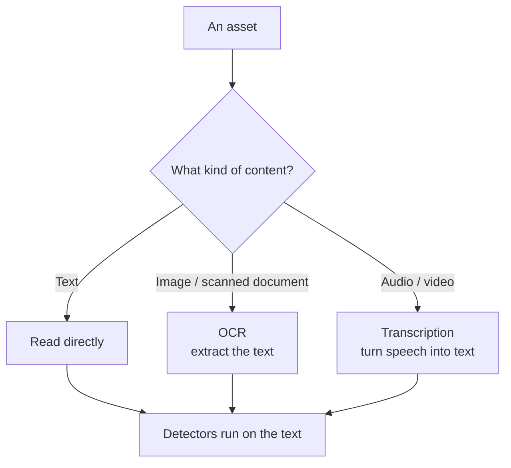

# OCR & Transcription

Detectors work on **text**. A lot of important content, though, isn't text to
begin with — it's locked inside scanned PDFs, screenshots, images, and audio or
video files. Classifyre unlocks that content automatically, so your detectors
can see it. There is no switch to flip: this runs for every source, on every
scan.

```mermaid
graph TD
    Asset["An asset"]
    Asset --> Q{"What kind of content?"}
    Q -->|"Text"| Text["Read directly"]
    Q -->|"Image / scanned document"| OCR["OCR<br/>extract the text"]
    Q -->|"Audio / video"| Trans["Transcription<br/>turn speech into text"]
    Text --> Detect["Detectors run on the text"]
    OCR --> Detect
    Trans --> Detect
```

There is nothing to configure per source. If a file's content calls for it, the
text is extracted; if there is no text to find, the file is still catalogued
with its metadata and tracked across scans.

---

## OCR — read images and documents

**OCR** (Optical Character Recognition) extracts readable text from images and
supported binary documents before the text-capable detectors run.

It runs on content like:

- Scanned PDFs and faxes
- Screenshots and photos of documents
- Images that may contain text (whiteboards, ID cards, forms)

A screenshot that contains a leaked API key or a scanned form with
personal data becomes searchable by your detectors — instead of slipping through
as "just an image."

How it works under the hood:

- PDFs with a real text layer are read directly — no heavy machinery involved.
  Only PDFs with almost no extractable text (fewer than 50 characters, the sign
  of a scanned or image-only file) go through the full OCR pipeline.
- Images (PNG, JPG, TIFF, BMP, WEBP, GIF, HEIC / HEIF) are read with OCR.
  Animated GIFs contribute their first frame; HEIC / HEIF files are converted
  to PNG first.
- Tiny images are skipped: anything under 32 pixels on one axis — tracking
  pixels, spacer images, favicons, page icons — holds no legible text, so it is
  left as metadata rather than sent through OCR.

> **Trade-off:** OCR does extra work per image, so scans of image-heavy sources
> take a little longer. There is no per-source switch — to keep a scan focused,
> exclude image extensions or paths in the source's
> **[configuration](/sources/configuration/)** instead.

---

## Transcription — turn speech into text

**Transcription** converts the speech in **audio and video** files into text, so
detectors can run over what was *said*, not just the file's metadata.

It runs on content like:

- Meeting or call recordings
- Video posts and webinars
- Voice notes and podcasts

A recorded meeting where someone reads out a customer's
details becomes text your detectors can flag.

How it works under the hood:

- Audio files are transcribed with a speech model (faster-whisper, medium by
  default, CPU).
- Video files get both: a transcript of what was said **and** the text visible
  on screen, read from sampled frames.
- Deployments can trade speed for accuracy with the `CLASSIFYRE_WHISPER_MODEL`,
  `CLASSIFYRE_WHISPER_DEVICE`, `CLASSIFYRE_WHISPER_COMPUTE_TYPE`,
  `CLASSIFYRE_WHISPER_BEAM_SIZE`, `CLASSIFYRE_WHISPER_VAD_FILTER`, and
  `CLASSIFYRE_WHISPER_WORD_TIMESTAMPS` environment variables. These are
  deployment-wide settings, not per-source options.

> **Trade-off:** Transcription is the heaviest content step — it's noticeably
> slower than reading text or doing OCR, and it needs the transcription
> capability present in your deployment. If a source holds hours of recordings
> you don't need searched, exclude those paths or extensions in the source's
> **[configuration](/sources/configuration/)**.

---

## How they fit with the rest of a source

- Content extraction is automatic per file type — it decides *what content* is
  read from each sampled item, while [sampling](/sources/sampling/) decides
  *which items* are read.
- Extracted text flows into exactly the same detectors as ordinary text — there's
  nothing extra to configure on the detector side.
- They're independent: a file gets whichever of the two its content calls for.

| Step | Unlocks | Cost |
|---|---|---|
| **OCR** | Text inside images & scanned documents | Some extra time per image |
| **Transcription** | Speech inside audio & video | Significant extra time; needs the capability available |

Next: confirm a source connects, and put scans on a schedule —
**[Testing & Scheduling](/sources/testing/)**.
