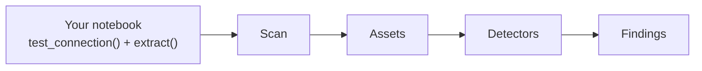
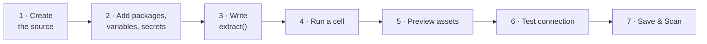
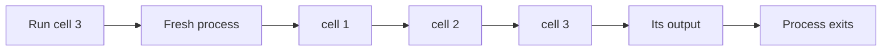

import { Callout, Steps } from "nextra/components";

# Custom Connectors

Classifyre ships connectors for the systems most people have. When you have one
nobody has heard of — an internal API, a legacy database behind a bespoke
gateway, a vendor with an unusual export — a **Custom connector** lets you write
it yourself, in Python, in a notebook inside the app.

It behaves like any other source once it exists: it scans on a schedule, feeds
the same detectors, produces the same assets and findings.



---

## What a notebook has to do

A connector answers two questions, so your notebook defines two functions:

| Function                  | Question it answers                                     | Required |
| ------------------------- | ------------------------------------------------------- | -------- |
| `test_connection()`       | _Can we reach the system, and do the credentials work?_ | Yes      |
| `extract()`               | _What is there to scan?_                                | Yes      |
| `discover()`              | _What can this source see?_ — for a richer overview     | No       |
| `fetch_content(asset_id)` | _Give me one asset's content on demand_                 | No       |

You don't start from an empty page. A new Custom source opens on a **starter
notebook** that already defines both required functions and already runs, so
your first edit is a change to working code rather than a guess at what's
expected.

<Callout type="info">
  A cell that holds the last copy of `test_connection()` or `extract()` can't be
  deleted — the delete button is disabled and tells you why. Write a second copy
  elsewhere first and the lock moves with the code.
</Callout>

---

## Getting started



<Steps>

### Create the source

**Sources → New source → Custom Connector.** Give it a name. The notebook opens
on the starter cells.

### Declare what you need

Packages, variables and secrets all live above the notebook — see
[Packages, variables & secrets](#packages-variables--secrets).

### Write your `extract()`

Autocomplete knows the whole Classifyre SDK: type `ctx.` or `Asset(` and it
offers the real methods and fields with their real signatures, because the list
is generated from the SDK itself.

### Save

Cells save automatically as you type; `Cmd/Ctrl + S` forces it.

</Steps>

The one thing you can't do before saving is _run_. A run always names a saved
revision of the notebook, so on a brand-new source the Run buttons appear once
the source exists.

---

## Running cells

Each cell has a **▶** button; the notebook toolbar has **Run all**.

| Shortcut           | Does                 |
| ------------------ | -------------------- |
| `Cmd/Ctrl + Enter` | Run the current cell |
| `Shift + Enter`    | Run the current cell |
| `Cmd/Ctrl + S`     | Save the notebook    |

### There is no persistent kernel

This is the one thing worth understanding, because it explains everything else.

Running a cell does **not** continue from whatever ran before. It starts a fresh
Python process and re-runs **the current source of every cell above it**, in
order, then your target cell.



The payoff: **what you see is what runs.** There's no hidden state left over
from a cell you edited an hour ago, and no result that depends on an execution
order you can't see. The notebook that works in the editor is the notebook that
runs on a schedule.

The cost is real and worth knowing:

- **Cells above yours run again.** If cell 1 loads something slow, every run
  pays for it. Keep expensive work behind `ctx.limit` while you're iterating.
- **Side effects repeat.** A cell that sends, writes or deletes will do it again
  every time you run a later cell. Notebooks are for reading and transforming;
  keep anything that changes another system out of one.

### Reading the output

Only the cell you ran shows output — the cells replayed to rebuild state stay
quiet, so you aren't handed three screens of `print()` from earlier steps. **Run
all** shows every cell's output.

`print()` appears as text. The final expression of a cell is displayed the way a
notebook would: a DataFrame renders as a table, a matplotlib figure as an image,
anything else as its `repr`.

### When a cell fails

The cell that actually raised is highlighted — **which is not always the one you
clicked.** If cell 3 depends on cell 2 and cell 2 breaks, the error is reported
against cell 2, with a traceback in _cell_ line numbers and none of Classifyre's
own frames in it.

---

## Preview, test, scan

Three buttons, three different questions:

| Button              | Asks                                    | Use it when                                                   |
| ------------------- | --------------------------------------- | ------------------------------------------------------------- |
| **Test connection** | Does `test_connection()` succeed?       | Checking credentials or a URL                                 |
| **Preview assets**  | What does `extract()` actually produce? | Checking the shape of your assets before committing to a scan |
| **Save & Scan**     | Run the whole thing for real            | The notebook is ready                                         |

**Preview assets** is the one to reach for most. It runs `extract()` and shows
you the first few assets — ids, names, kinds, metadata, links, a content preview
— without ingesting anything. It's how you find out you forgot a `name` or that
`metadata` is empty, before a scan writes thousands of rows.

<Callout type="info">
  Preview and Test both check the contract first. If `extract()` isn't defined
  yet you get a clear message saying so — but you can still **run individual
  cells** while the notebook is half-written. Only the buttons that call those
  functions require them.
</Callout>

---

## Packages, variables & secrets

Everything your notebook needs from outside itself is declared above the cells.

### Packages

A table of **Name** and **Version**, installed with `uv` before the first cell
runs. Leave the version empty for the latest.

| Name      | Version   | Installs      |
| --------- | --------- | ------------- |
| `httpx`   | _(empty)_ | latest        |
| `pandas`  | `2.2.0`   | exactly that  |
| `pymssql` | `>=2.3`   | that or newer |

Beneath the table is **Already available** — a read-only list of everything the
scan runtime already has, with the version it will actually be. Search it before
adding a row: `requests`, `lxml` and `beautifulsoup4` are always importable, and
so are `pdfplumber`, `duckdb`, `pyarrow`, `boto3`, `psycopg2`, `pymongo`,
`confluent-kafka` and the rest of the connector stack.

Anything marked **on demand** is installed automatically the first time one of
your cells imports it — you don't list it, you just `import duckdb`. The editor
completes these on an import line and shows the version on hover.

Declare a package only when it genuinely isn't there. Re-declaring one that is
costs an install on every run, at a version that may not be the one the rest of
the runtime was resolved against.

### Variables and secrets

Both are key/value tables. The difference is what happens to the value:

|               | Stored     | Read with                 | Shown in logs & output |
| ------------- | ---------- | ------------------------- | ---------------------- |
| **Variables** | Clear text | `ctx.var("api_base")`     | Yes                    |
| **Secrets**   | Encrypted  | `ctx.secret("api_token")` | Replaced with `••••`   |

```python
import httpx
from classifyre import Asset, ctx

response = httpx.get(
    f"{ctx.var('api_base')}/tickets",
    headers={"Authorization": f"Bearer {ctx.secret('api_token')}"},
)
```

Keys must be valid Python identifiers — `api_base`, not `api-base` — because
that's how you read them back. The form tells you if a key won't work.

<Callout type="warning">
  Secret values are never sent back to your browser. Editing a source shows
  which secrets exist, not what they are; leaving one blank keeps it unchanged,
  and clearing the row deletes it.
</Callout>

Two things secrets do **not** protect against, worth being clear about:

- Anyone who can edit this notebook can print its secrets. They're redacted from
  logs and output, but the code can read them — that's what makes them usable.
- If your `extract()` puts a secret into an asset's **content**, it gets stored
  and scanned like any other text. That's deliberate: a connector leaking its own
  token into every record is a finding you want to see.

---

## Files

A notebook reaches files two ways. Which one you use is decided by where
Classifyre is running, not by preference.

### Uploaded files — everywhere

Upload files to the source and they arrive as `ctx.files`. They're downloaded to
the runner before any cell runs, so each one is an ordinary path:

```python
from classifyre import Asset, ctx

def extract():
    for file in ctx.files:
        parsed = file.parse()          # PDF, DOCX, XLSX, EML, images, Parquet…
        yield Asset(
            id=file.name,
            name=file.name,
            kind="file",
            content=parsed.text,
            content_bytes=file.read_bytes(),
        )
```

This is the mechanism that works in a Kubernetes deployment, where the runner is
an ephemeral pod with no filesystem of yours to reach.

### Local folders — desktop only

In the desktop app you can also point the source at a folder on your machine and
read it in place — the right choice for a dump too large to upload. Add it under
**Local folders**, then:

```python
def extract():
    for path in ctx.folder("dumps").rglob("*.json"):
        if ctx.should_abort:
            return
        yield Asset(id=str(path.name), content=parse(path).text)
```

Nothing is copied. Saving a source with local folders is refused in a Kubernetes
deployment, with a message pointing at uploads instead.

<Callout type="warning">
  Local folders are a convenience, not a sandbox. The notebook process runs as
  you and can open any path you can; the list exists so your connector refers to
  a folder by name rather than by a hard-coded path.
</Callout>

### Parsing

`parse()` is the same extractor every built-in file source uses. Hand it a path,
raw bytes, an open handle or a `ctx.files` entry and it works out what it is:

```python
parsed = parse(some_bytes, name="report.pdf")
parsed.text        # extracted text, OCR'd if it needed to be
parsed.mime_type   # detected
parsed.error       # set instead of raising, when the file can't be read
```

For something too big to hold whole, `pages()` yields rows (tabular) or lines
(everything else) a page at a time.

Full details in the [reference](/sources/custom-connectors/reference/).

---

## Tagging what you already know

Some facts do not need detecting. If the system you are reading from already
knows that a table holds cardholder data or that a folder is under legal hold,
running a classifier over the content to re-derive it can only lose information.

Create a [Tag detector](/detectors/custom-detectors/tag/), then write its key in
`Asset.tags`. The value you pass becomes a finding on the asset, with that
detector's label and severity:

```python
yield Asset(
    id="prod.payments.transactions",
    name="transactions",
    kind="table",
    tags={"cardholder_data": "primary-account-numbers"},
)
```

Tag detectors are not selectable on a source. Every active one is available to
every Custom connector automatically, so a new tag needs no source change.

---

## Templates

The **Templates** button under the cells inserts a complete worked notebook —
uploaded files, local folders, file parsing, linked assets, lineage, tagging, a
paged REST API. Its cells are added below what you already have; nothing you
wrote is replaced.

---

## Sampling

A Custom source uses the same [sampling strategies](/sources/sampling/) as
everything else, and **they all work whether or not your code mentions them.**

| Strategy      | What you get for free                                | What your code can improve                                                 |
| ------------- | ---------------------------------------------------- | -------------------------------------------------------------------------- |
| **All**       | Everything you yield                                 | —                                                                          |
| **Automatic** | A fresh slice each run, remembering where it stopped | Read `ctx.offset` to page at the source instead of yielding and discarding |
| **Latest**    | The first N you yield                                | Yield newest-first — a stream has no order of its own                      |
| **Random**    | A genuinely uniform sample                           | Nothing; this one reads everything to be fair                              |

The efficient version is to push the run's window into your own query:

```python
def extract():
    # ctx.limit is how many this run wants; ctx.offset is where to start.
    for row in api.list(offset=ctx.offset, limit=ctx.limit):
        yield Asset(id=str(row["id"]), name=row["title"], content=row["body"])
```

<Callout type="info">
  Reading `ctx.offset` tells Classifyre you've applied it yourself, so it stops
  skipping on top of you. If you ignore it, paging still works — your
  `extract()` just produces the earlier items and they're discarded.
</Callout>

---

## Taking it to production

The notebook is a _source-code model_, not a runtime. **Download `workflow.py`**
gives you the whole thing as an ordinary Python module using the familiar `# %%`
cell markers:

```python
# %% id=imports
from classifyre import Asset, ctx

# %% id=extract
def extract():
    ...
```

`# %%` is only a comment, so the file runs under plain `python workflow.py`.
That's also why notebook cells must stay **valid standard Python** — IPython
magics like `%time` or `!pip install` are rejected, because they wouldn't
survive the trip.

---

## Working with someone else

Notebooks are versioned. Every save bumps a revision, and every run names the
revision it executed — so a result always points at code you can still read.

If someone else saves while you're editing, your save is refused rather than
silently overwriting theirs, and you're offered a reload. Runs always execute a
_saved_ revision, never unsaved edits.

---

Next: the full **[Notebook reference](/sources/custom-connectors/reference/)** —
every `ctx` method, every `Asset` field, and what to do when something goes
wrong.
