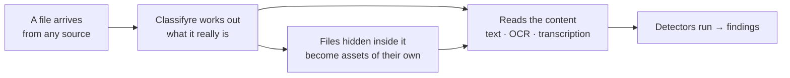

# Supported File Formats

Connect a system and Classifyre reads what's actually in it — not just the plain
text. The scanned contract, the spreadsheet attached to a ticket, the screenshot
pasted into a chat thread, the images packed inside a dataset: each becomes
content your detectors can search.

This page answers the two questions that come up first: **what can Classifyre
read**, and **which sources do those files come from?**

The format is worked out from the file's **contents**, not just its name — so a
mislabelled export, a file with no extension, or a document a system reports as
"binary" is still read as what it really is. That matters in practice: cloud
storage tends to label almost everything as generic binary data.

---

## Which file formats does Classifyre support?

| Content type          | File types                                                 | What Classifyre gets out of it                                        |
| --------------------- | ---------------------------------------------------------- | --------------------------------------------------------------------- |
| **Documents**         | PDF, DOCX, PPTX, RTF, ODT, ODP, and legacy DOC / XLS / PPT | The full text, including tables — with OCR for pages that are scans   |
| **Spreadsheets**      | XLSX, ODS                                                  | Every sheet, row by row                                               |
| **Tables & datasets** | CSV, TSV, Parquet, Arrow, Feather, IPC                     | Every row, with columns labelled so a finding points at a real record |
| **Text & data**       | TXT, Markdown, JSON, XML, HTML, log files                  | The content as written, with encoding detected automatically          |
| **Code & config**     | Python, JavaScript / TypeScript, Java, Go, Rust, C / C++, C#, Ruby, PHP, Swift, Kotlin, shell, SQL, Terraform, YAML, TOML, INI, `.env`, Dockerfile, Makefile | Every line, exactly as written — including the comments |
| **Email**             | EML, MSG                                                   | Sender, recipients, subject, body, and attachment names               |
| **Images**            | PNG, JPG, TIFF, BMP, WEBP, GIF, HEIC / HEIF                | Text inside the image, via [OCR](/sources/content-extraction/)        |
| **Audio**             | MP3, WAV, M4A, AAC, OGG, OPUS, FLAC                        | A transcript of what was said                                         |
| **Video**             | MP4, MOV, MKV, WEBM, AVI, WMV, FLV                         | A transcript **and** the text visible on screen                       |
| **Archives**          | ZIP, TAR, GZ, TGZ, 7Z, RAR                                 | Each file inside, unpacked and scanned on its own                     |

Images, audio, and video need [OCR and transcription](/sources/content-extraction/)
switched on for the source — they're off by default because they cost more time
per item than reading text.

---

## Source code and configuration

Code files are read as the text they are, so a key committed to
`config/settings.py`, a password in `values.yaml`, or a live token in `.env` is
found the same way one in a spreadsheet is. Roughly eighty extensions are
recognised, plus the files that carry no extension at all — `Dockerfile`,
`Makefile`, `Jenkinsfile`, `Gemfile`, `.env.production`.

This matters more than it sounds. A Python module whose first line is
`from typing import Any, Dict, List` has two commas on line one, which is
exactly what a spreadsheet's header row looks like — and a minified JavaScript
bundle starts with `{`, which is exactly what a JSON file looks like. Read by
content alone, both get sent to a table reader that produces columns of
nonsense and finds nothing. Classifyre uses the file name to settle it, so the
file is read line by line as source.

The most common places a real credential turns up are the ones you would
expect: `.env` and its per-environment variants, Terraform variable files, CI
pipeline definitions, Kubernetes manifests, and connection strings in
application config. All of them are read.

---

## Files hidden inside other files

A lot of sensitive data doesn't sit in a file — it sits in a file _inside_ a
file. Classifyre unpacks those and treats each one as a **separate asset**, with
its own detectors, findings, and link back to the file it came from.

| Where it hides                | Example                                                            |
| ----------------------------- | ------------------------------------------------------------------ |
| **Inside an archive**         | A ZIP in cloud storage holding 40 customer spreadsheets            |
| **Inside a dataset's rows**   | An ML dataset whose `image` or `document` column holds whole files |
| **Inside an Office document** | Screenshots embedded in a slide deck or a spreadsheet              |

In the row text, an embedded file shows up as a compact placeholder such as
`<image: 41 KB>` — the bytes themselves are scanned as their own asset, so a
passport photo in row 4,000,001 gets flagged as an image finding rather than
disappearing into a wall of unreadable characters.

Two things worth knowing:

- **Unpacking happens for file-based sources** — cloud storage, local folders,
  direct uploads, Dropbox, and Hugging Face. A ZIP attached to a Jira ticket is
  catalogued and tracked, but its contents aren't split out.
- **Unpacking follows your sampling settings** — the files inside the rows a run
  reads become assets on that run. Fan-out is capped per file, so one dataset
  can't turn into a million assets overnight.

---

## Large files and very big tables

Big files aren't truncated, and they aren't loaded into memory whole. Classifyre
streams them, so a multi-gigabyte export is read the same way a small one is.

For anything with rows — CSV, Parquet, Arrow, spreadsheets, database tables —
your [sampling strategy](/sources/sampling/) also governs _how much of each file_
a single run reads:

| Strategy      | What one run reads of a single table               |
| ------------- | -------------------------------------------------- |
| **Automatic** | The next slice of rows, resuming where it left off |
| **Latest**    | The first rows of the file                         |
| **Random**    | A different sample each run                        |
| **All**       | Everything                                         |

With **Automatic**, a 40-million-row Parquet file is covered slice by slice
across scheduled runs instead of blocking one enormous scan, and progress is tied
to the file's contents — if the file changes, the sweep restarts rather than
resuming into rows that have moved.

For Parquet and Arrow files held in cloud storage, only the part of the file a
run actually needs is fetched. A multi-gigabyte dataset shard can be scanned
without ever being downloaded in full — which is what keeps egress costs and scan
times predictable on large data lakes.

---

## Which sources do files come from?

Everything above applies to these sources — this is where documents, images,
media, and archives enter Classifyre.

| Source                                                                                                                                                       | What it brings                                                |
| ------------------------------------------------------------------------------------------------------------------------------------------------------------ | ------------------------------------------------------------- |
| [S3-compatible storage](/sources/s3-compatible-storage/), [Azure Blob](/sources/azure-blob-storage/), [Google Cloud Storage](/sources/google-cloud-storage/) | Every object in a bucket or container                         |
| [Local folder](/sources/local-folder/)                                                                                                                       | A directory tree on the machine running the scan              |
| [Git repository](/sources/git/)                                                                                                                              | Every file on one branch — code, config, docs, and committed data |
| [Sandbox](/sources/sandbox/)                                                                                                                                 | Files uploaded straight into Classifyre                       |
| [Dropbox](/sources/dropbox/)                                                                                                                                 | Files and shared folders                                      |
| [Hugging Face](/sources/hugging-face/)                                                                                                                       | Dataset and model repository files, including large shards    |
| [Confluence](/sources/confluence/), [Jira](/sources/jira/), [Jira Service Management](/sources/servicedesk/)                                                 | Pages, issues, requests, comments — **and their attachments** |
| [Notion](/sources/notion/)                                                                                                                                   | Pages, data sources, comments, and uploaded files             |
| [Slack](/sources/slack/)                                                                                                                                     | Messages and shared files                                     |
| [Email](/sources/email/)                                                                                                                                     | Messages and every attachment                                 |
| [Google Workspace](/sources/google-workspace/)                                                                                                               | Drive files, Docs, Sheets, and Slides                         |
| [Microsoft 365](/sources/microsoft-365/)                                                                                                                     | SharePoint, OneDrive, and Teams files                         |
| [Reddit](/sources/reddit/)                                                                                                                                   | Posts, comments, and attached media                           |

### Sources that bring records rather than files

These systems produce rows and documents instead of files. They're read directly
— no file parsing involved — and the same sampling controls apply.

| Category                  | Sources                                                |
| ------------------------- | ------------------------------------------------------ |
| **Databases**             | PostgreSQL, MySQL, SQL Server, Oracle, SQLite, MongoDB |
| **Graph**                 | Neo4j                                                  |
| **Search**                | Elasticsearch, OpenSearch, Meilisearch                 |
| **Warehouse & lakehouse** | Snowflake, Databricks, Hive, Delta Lake, Iceberg       |
| **Streaming**             | Kafka                                                  |
| **Analytics & BI**        | Power BI, Tableau                                      |
| **Web & social**          | WordPress, YouTube                                     |

The full, always-current list — with every configuration field per system — is in
the **[source catalog](/sources/)**.

---

## Controlling what gets picked up

Reading everything is rarely what you want. Most file-based sources let you
restrict the scan before anything is downloaded:

- **By file type** — include or exclude extensions, so a bucket of build
  artefacts doesn't consume a scan meant for documents.
- **By path** — pattern filters such as `data/**/*.parquet` on object storage.
- **By scope** — specific folders, projects, channels, labels, or mailboxes,
  depending on the system.

Filtering by name is far cheaper than downloading and discarding, so it's the
first lever to reach for on a large source. See
**[Configuration & Fields](/sources/configuration/)** for what each source
supports.

---

## Common questions

**Does Classifyre read scanned PDFs?**
Yes. PDFs with a text layer are read directly; pages that are images get OCR, so
scanned contracts and faxes are searchable. Turn on
[OCR](/sources/content-extraction/) for the source.

**Can it read files inside a ZIP?**
Yes — for file-based sources, each file in the archive becomes its own asset with
its own findings. Archives nested inside archives are catalogued but not opened
recursively.

**Does it handle Parquet and Arrow datasets?**
Yes, row by row, including columns that hold whole files such as images or
documents. Large shards in cloud storage are read in place rather than
downloaded.

**Does it read source code?**
Yes — around eighty languages and configuration formats, plus extension-less
files such as `Dockerfile` and `Makefile`. Each is read line by line as text, so
a secret in a config file is found the same way one in a document is.

**What about audio and video?**
Both are transcribed, and video also has the text on screen read via OCR. Enable
[transcription](/sources/content-extraction/) on the source.

**Will very large files break a scan?**
No. Files are streamed rather than loaded whole, and tables are read in bounded
slices set by your [sampling strategy](/sources/sampling/).

**What happens to a file type that isn't supported?**
It's still catalogued with its metadata and tracked across scans — it simply has
no text for detectors to read.

---

## Next steps

- Decide how much of each source to read — **[Sampling Strategies](/sources/sampling/)**
- Unlock images, audio, and video — **[OCR & Transcription](/sources/content-extraction/)**
- See what a scan produces — **[Assets & Metadata](/sources/assets-and-metadata/)**
- Browse every connector — **[Source Catalog](/sources/)**
