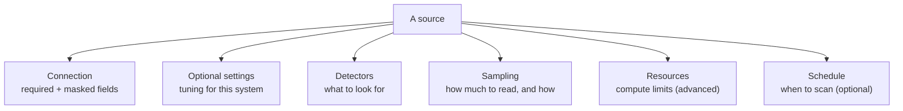

# How Sources Work

A **source** is a connection to a system you already run — a database, a data
lake, a collaboration tool, a content platform — that you want Classifyre to
look inside. Once connected, Classifyre **scans** the source, pulls out
individual items (an **asset** per table, file, page, message, or video), runs
**detectors** over them, and records any **findings**.

Every source type has its own dedicated reference page generated from its
schema — see the **[Catalog](/sources/)** for the exact fields each one accepts.
This guide explains the ideas that apply to *all* of them.

---

## The shape of a source

However different two systems are, every source you configure is built from the
same parts:

| Part | What it is | Learn more |
|---|---|---|
| **Connection** | The mandatory details to reach the system, plus secrets like tokens and passwords | [Configuration & Fields](/sources/configuration/) |
| **Optional settings** | Per-system tuning — filters, limits, scope | [Configuration & Fields](/sources/configuration/) |
| **Detectors** | The built-in and custom detectors that run on the content | [Detectors](/detectors/) |
| **Sampling** | How much data is read each run, and in what order | [Sampling Strategies](/sources/sampling/) |
| **Content extraction** | Whether to read images (OCR) and audio/video (transcription) | [OCR & Transcription](/sources/content-extraction/) |
| **Resources** | Compute limits for large scans (advanced) | This page, below |
| **Schedule** | An optional recurring scan time | [Testing & Scheduling](/sources/testing/) |

Only two parts are mandatory for every source: the **required** connection
fields and a **sampling** strategy. Everything else has sensible defaults.

---

## From connection to findings

Here's the journey a source takes, end to end:

```mermaid
stateDiagram-v2
    direction LR
    [*] --> Configure: Fill in connection + options
    Configure --> Test: Test the connection
    Test --> Scan: Run a scan (manual or scheduled)
    Scan --> Assets: Discover & read items as assets
    Assets --> Detect: Run detectors on each asset
    Detect --> Findings: Record findings
    Findings --> [*]
```

1. **Configure** — provide the connection details and choose your options.
2. **Test** — confirm Classifyre can actually reach the system before committing
   to a full scan. See [Testing & Scheduling](/sources/testing/).
3. **Scan** — kick off a run by hand, on a schedule, or let it happen as part of
   your workflow.
4. **Discover & read** — the scanner lists everything in the source and reads a
   slice of it as **assets**, governed by your [sampling strategy](/sources/sampling/).
5. **Detect** — detectors run over each asset's content.
6. **Findings** — anything a detector flags becomes a finding, ready for
   triage and investigation.

> Want the detail on what a scan does between "running" and "done" — including
> how repeat scans diff against the last one? That lives in the
> **[Scans](/flow/)** section. What happens to findings *after* they appear is
> covered in **[Investigations](/investigations/)** and
> **[Autopilot](/investigations/autopilot/)**.

---

## Assets: the unit of scanning

Whatever the system, Classifyre normalises its contents into **assets** — one per
meaningful item:

| Source kind | One asset is… |
|---|---|
| Database / warehouse | A table (read in row batches) |
| File / object storage | A file |
| Collaboration tool | A page, message, or document |
| Content platform | A video, post, or article |

Each asset carries **metadata** (its name, location, and source-specific details)
and **content** (the text — or, with OCR/transcription, the extracted text). Both
are available to detectors. Every source's reference page lists exactly which
metadata it extracts.

---

## A note on resources (advanced)

Large scans can be tuned with **resource** settings — CPU and memory limits, a
runtime timeout, and how many items are processed in parallel. The defaults are
fine for most sources; you only need these when scanning very large systems or
when running on constrained infrastructure. Each setting is documented on the
per-source reference pages.

---

Next, get specific about the fields you fill in:
**[Configuration & Fields](/sources/configuration/)**.
