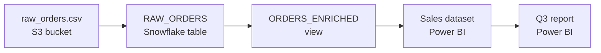
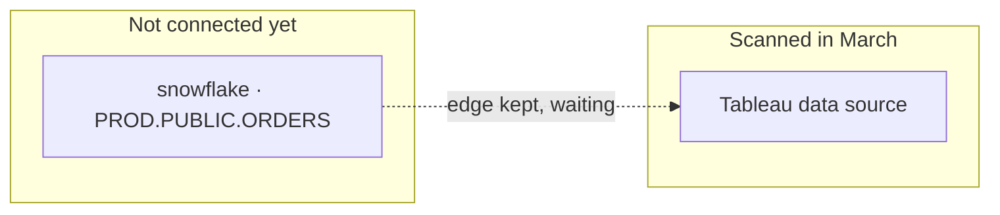

# Lineage & Relationships

Assets rarely stand alone. A report is built from a dataset, which is built from
a warehouse table, which was loaded from a file someone dropped in a bucket. A
ticket has an attachment. A page mentions another page.

**Lineage** is the answer to two questions that keep coming up once you find
something sensitive:

- **Where did this come from?** — the customer export has card numbers in it;
  which upstream table leaked them in?
- **What breaks if I change it?** — we want to drop this column; what stops
  working?

Classifyre records those relationships while it scans, from the systems' own
catalogs, and shows them on every asset.

---

## Not every connection is lineage

The reason lineage graphs turn into unreadable hairballs is that everything gets
flattened into one kind of "link". An attachment, a foreign key, a duplicate
file and a derived table are four completely different relationships, and only
one of them answers *"what breaks if I change this?"*.

So every relationship Classifyre records carries a **class** that says what
traversing it actually means:

| Class | Means | Example | Is it lineage? |
|---|---|---|---|
| **Lineage** (`FLOW`) | The values in one came from the other | A view over its base tables | **Yes — this is the lineage graph** |
| **Contains** (`CONTAINMENT`) | One is a part of the other | A chart in a dashboard; a file in an archive | No — it's what the graph is *collapsed by* |
| **Same as** (`IDENTITY`) | The same real thing, seen twice | The same file in two buckets | No — it's what nodes are *merged by* |
| **References** (`REFERENCE`) | One points at the other | A foreign key; a page linking to a page | No — it propagates nothing |
| **Used by** (`USAGE`) | Somebody touched it | A person who owns or opened it | No — it's a weight, not a path |

This distinction is what keeps the lineage view honest. A **foreign key moves no
data**, so it is recorded — it's a good hint about where lineage might exist —
but it never becomes a hop in a lineage path. Everything the system is unsure
about is filed as a reference, the class that propagates nothing, rather than
being quietly admitted into lineage.

---

## Kinds of lineage

Within lineage itself, the *nature* of the derivation is recorded too. In the
app these read as plain phrases on the arrow:

| Shown as | What it means |
|---|---|
| **derived** | Computed from the upstream, with real logic in between |
| **view of** | A view or a report over its base tables |
| **copy of** | A replica or mirror — the same values, moved |
| **written by** | A process or job produced this |
| **exported to** | The data left the system |
| **sent to** | The data was delivered to a recipient |

Arrows always point **the way the data moves**: upstream on the left, downstream
on the right. So walking *outward* from an asset answers "what breaks if this
changes", and walking *inward* answers "where did this come from".

---

## Column-level lineage

Table-to-table lineage tells you two tables are connected. That is often not
precise enough to act on — before you drop a column you need to know whether
*this* column feeds anything.

Where the information exists, Classifyre records the mapping **per column**:
which upstream columns feed each output column, and the expression in between.
Open an asset with columns and pick one to see exactly what feeds it.

A column can also matter *without* feeding any output column — a date used in a
`WHERE`, a join key, a sort. Those shape which rows came out but no particular
value, and they're listed separately as **indirect** dependencies rather than
being drawn as an arrow into a column they don't actually feed.

> **Where column detail comes from.** Some systems answer the column question
> directly (Databricks Unity Catalog, SQL Server). For the rest, it is recovered
> from the view's own SQL. A `SELECT *` view yields no column mappings at all —
> the edge stays at table level, which is the honest answer. A confidently wrong
> column mapping is worse than a missing one.

---

## How much to trust an edge

Not all lineage is equally certain, so each relationship records **how it was
derived**. The app shows this next to the relationship when you select it:

| How it was known | Meaning |
|---|---|
| **Runtime observed** | Something watched the data actually move |
| **System catalog** | The platform's own catalog said so |
| **SQL parsed** | Read out of the query or view definition |
| **Heuristic** | Inferred — a reasonable guess, no more |
| **Manual** | A person drew it |

Two sources are allowed to disagree about the same pair of assets; both edges
are kept with their own provenance rather than one silently overwriting the
other. Where an edge came from SQL, the SQL itself is kept with it, so you can
read the derivation instead of trusting a label.

---

## Lineage across systems

The most valuable lineage crosses a boundary — a Tableau data source reading a
Snowflake table, a Databricks table loaded from an S3 path. The awkward part is
that the two halves are usually scanned by different connectors, sometimes
months apart.

Classifyre handles this by naming objects the way **their own platform** names
them, independently of who scanned them. A Tableau scan can point at a Snowflake
table it has never seen, and the edge is kept in place. If a Snowflake source is
connected later, the two halves recognise each other and the lineage completes
itself — retroactively.

Until the other system is connected, those endpoints appear in the lineage view
as **not yet scanned** — outlined nodes with a name but no content. They're a
useful finding in themselves: they tell you which systems your data flows
through that Classifyre isn't watching yet.

---

## Where to see it in the app

Open any asset and choose the **Lineage** tab.

| Control | What it does |
|---|---|
| **Upstream / Downstream / Both** | Which way to walk — where it came from, what depends on it, or the full picture |
| **Collapse** | Rolls each item up into whatever contains it (tables into schemas, charts into dashboards) — how four hundred tables become twelve schemas without losing an edge |
| **Not yet scanned** | Counts endpoints in systems you haven't connected |

Below the graph, the **column lineage** panel traces a single column.

Relationships also appear throughout [investigations](/investigations/) — in the
case graph, relationship types are grouped by class, so lineage is visually
distinct from containment, duplicates, and references. Selecting any
relationship shows its class, how it was derived, whether it carries column
detail, and the SQL behind it where there is any.

You can also **draw a relationship by hand** in a case graph when you know
something the systems don't. Manual edges are marked as such, so they're never
mistaken for something a platform reported.

---

## Which sources produce lineage

Lineage is only as good as what the underlying system is willing to tell us. It
is not a setting you switch on — a source produces it if its platform exposes
it.

| Source | What it produces |
|---|---|
| [PostgreSQL](/sources/postgresql/), [MySQL](/sources/mysql/), [SQL Server](/sources/mssql/), [Oracle](/sources/oracle/), [Snowflake](/sources/snowflake/), [Hive](/sources/hive/) | Views and the tables they read from, with column detail parsed from the view SQL. Foreign keys as references. |
| [Databricks](/sources/databricks/) | Unity Catalog lineage, including true column-level lineage from the catalog itself |
| [Tableau](/sources/tableau/) | Data sources and the warehouse tables behind them; workbooks and projects as containment |
| [Power BI](/sources/powerbi/) | Reports and dashboards over their datasets, and the databases those datasets pull from |
| [SQLite](/sources/sqlite/) | Foreign keys as references |
| [Custom connectors](/sources/custom-connectors/reference/) | Whatever you declare — every relationship class is available to you |

Every other source still records **links** between the things it finds — a
comment on its issue, an attachment on its page, a file to the message it was
shared in. Those are relationships, and they show up in the graph; they are just
not lineage, because no data moved.

> **Nothing to see yet?** Lineage appears after a scan of a source that can
> report it. If an asset's Lineage tab is empty, either its source doesn't
> expose lineage, or the objects around it haven't been scanned yet.

---

## Building lineage yourself

If you know how your data moves and no system will tell us, a
[custom connector](/sources/custom-connectors/) can declare it directly — every
class on this page, column mappings included, plus the ability to point at
objects in systems the connector doesn't scan. See the
[notebook reference](/sources/custom-connectors/reference/#lineage).
