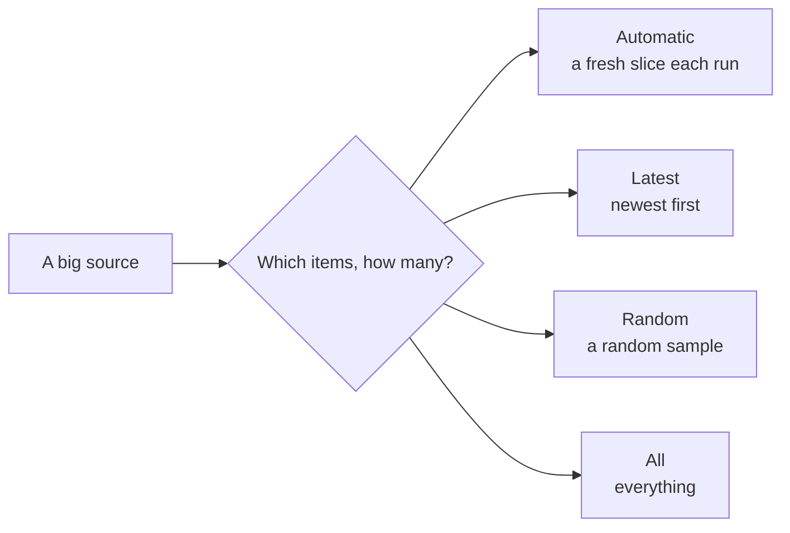
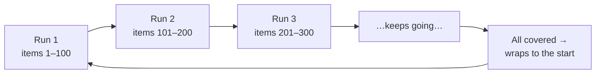
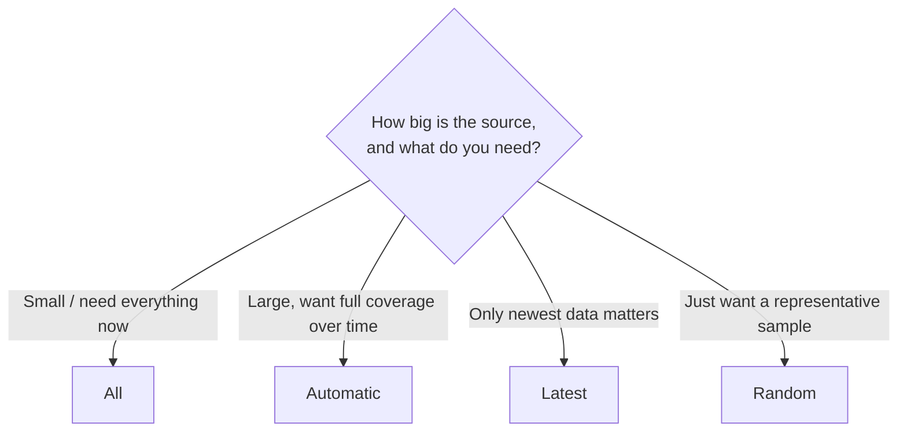

# Sampling Strategies

Some sources are tiny; others hold billions of rows or millions of files.
**Sampling** is how you tell Classifyre *how much* of a source to read on each
scan, and *which* items to prioritise. It's the single most important setting for
keeping scans fast, affordable, and useful — so it's mandatory for every source.

---

## The four strategies at a glance

| Strategy | What it reads | Best when |
|---|---|---|
| **Automatic** *(default)* | A new slice of not-yet-seen items each run, remembering where it left off | You want full coverage over time at a steady, bounded cost per scan |
| **Latest** | The most recently created or modified items first | Freshly added data is what matters most |
| **Random** | A random sample of items | You want a representative spot-check of a large source |
| **All** | Every item, with no limit | The source is small, or you need complete coverage in one pass |

If you're unsure, leave it on **Automatic** — it's designed to be the right
default for almost everything.

---

## Automatic — the recommended default

Automatic sampling gives you complete coverage *without* paying to read the whole
source every time. Each run ingests a fresh **slice** of items it hasn't seen
yet, remembers its position, and picks up from there next time. Once it has been
all the way through, it wraps back to the start and goes again.

- **Bounded cost per run** — every scan reads roughly one slice, so time and
  spend stay predictable no matter how big the source is.
- **Eventually everything** — keep scanning (ideally on a
  [schedule](/sources/testing/)) and the whole source gets covered, then
  refreshed on the next lap.
- **Remembers its place** — progress is saved between runs, so no item is
  repeatedly read while others are ignored.

This pairs naturally with a recurring schedule: a little, often, until it all
gets seen — then around again to catch changes.

---

## Latest — freshest first

Latest sampling prioritises the **most recently created or modified** items. Use
it when new data is the data that matters — recent uploads, the newest records,
this week's documents.

For tabular sources (databases, warehouses), Classifyre orders by a date-like
column:

- It **auto-detects** a sensible column (typically something like `created_at`
  or `updated_at`).
- You can name the column explicitly if you'd rather choose.
- If no ordering column can be found, it can **fall back to Random** so the scan
  still produces a useful sample rather than failing.

---

## Random — a representative spot-check

Random sampling reads a **random subset** of items. It's the quickest way to get
a representative feel for what's in a large source — great for an initial
assessment, a quality spot-check, or estimating how prevalent an issue is before
committing to fuller coverage.

---

## All — complete coverage in one pass

All reads **every item, with no limit**. Choose it when the source is small
enough to scan completely, or when you genuinely need exhaustive coverage in a
single run (for example, a compliance sweep that must touch everything at once).

> All is the most thorough strategy and also the most expensive — it reads
> everything, every scan. For large sources, **Automatic** usually gets you the
> same total coverage at a fraction of the per-run cost.

---

## The controls

A few settings shape how a strategy behaves. The most useful one applies to
**tabular sources** (databases and warehouses):

| Control | Applies to | What it does |
|---|---|---|
| **Rows per page** | Tabular sources | The size of each slice for Automatic / Latest / Random, and the batch size for All. Higher reads more per run but uses more memory. |
| **Order-by column** | Tabular + Latest | Which column defines "latest". Auto-detected if you don't set it. |
| **Fall back to Random** | Tabular + Latest | If no ordering column is found, sample randomly instead of failing. |
| **Include column names** | Tabular | Include column headers alongside sampled rows so detectors have more context. |

For non-tabular sources (files, messages, videos), the strategy controls *which*
items are read; there's no rows-per-page to set.

---

## Choosing the right strategy

| If you… | Choose |
|---|---|
| Aren't sure | **Automatic** |
| Run scheduled scans on a big source | **Automatic** |
| Care most about new/changed items | **Latest** |
| Want a quick, representative read | **Random** |
| Have a small source, or need a one-pass full sweep | **All** |

Next: let scans see more than plain text with
**[OCR & Transcription](/sources/content-extraction/)**.
