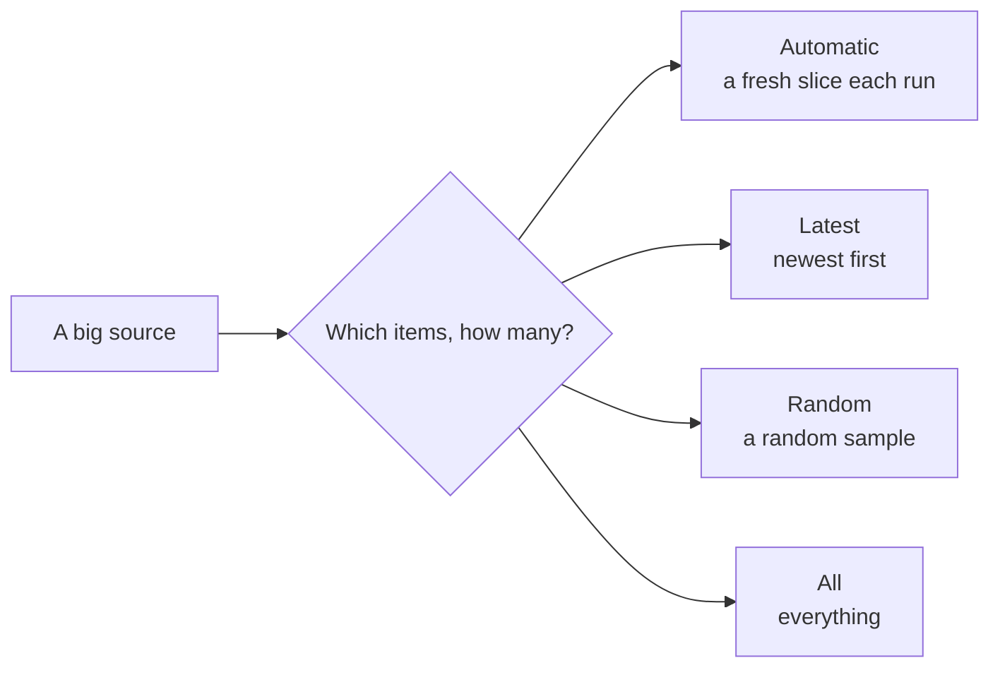
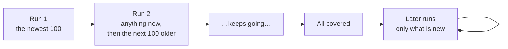
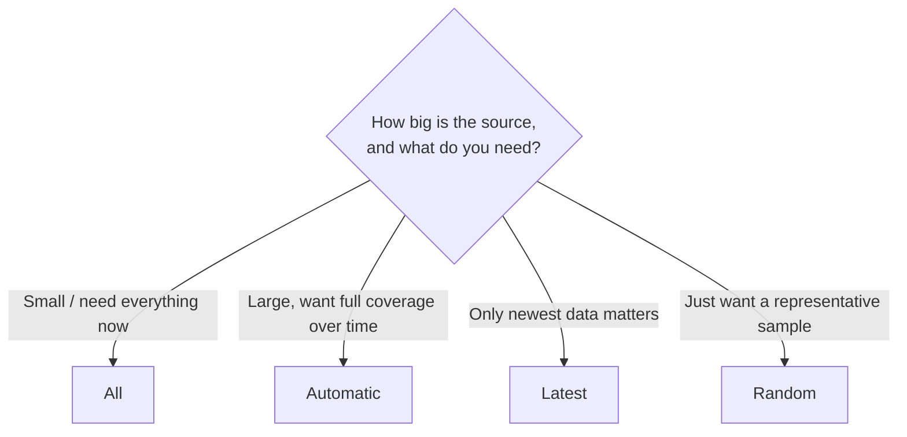

# Sampling Strategies

Some sources are tiny; others hold billions of rows or millions of files.
**Sampling** is how you tell Classifyre *how much* of a source to read on each
scan, and *which* items to prioritise. It's the single most important setting for
keeping scans fast, affordable, and useful — so it's mandatory for every source.

```mermaid
graph LR
    Source["A big source"] --> Strategy{"Which items, how many?"}
    Strategy --> Auto["Automatic<br/>a fresh slice each run"]
    Strategy --> Latest["Latest<br/>newest first"]
    Strategy --> Random["Random<br/>a random sample"]
    Strategy --> All["All<br/>everything"]
```

---

## The four strategies at a glance

| Strategy | What it reads | Best when |
|---|---|---|
| **Automatic** *(default)* | A bounded slice each run: whatever is new first, then more of what it hasn't seen yet | You want full coverage over time at a steady, bounded cost per scan |
| **Latest** | The most recently created or modified items first | Freshly added data is what matters most |
| **Random** | A random sample of items | You want a representative spot-check of a large source |
| **All** | Every item, with no limit | The source is small, or you need complete coverage in one pass |

If you're unsure, leave it on **Automatic** — it's designed to be the right
default for almost everything.

---

## Automatic — the recommended default

Automatic sampling gives you complete coverage *without* paying to read the whole
source every time. Each run reads one **slice** and remembers where it has been.
The first run starts with the newest items. Every run after that reads what is
**new or changed since the last run first**, then spends the rest of the slice
working backwards through older items it hasn't seen yet. Once it has been all
the way through, it stops going over old ground and reads only what is new.

```mermaid
graph LR
    R1["Run 1<br/>the newest 100"] --> R2["Run 2<br/>anything new,<br/>then the next 100 older"]
    R2 --> Dots["…keeps going…"]
    Dots --> Done["All covered"]
    Done --> New["Later runs<br/>only what is new"]
    New --> New
```

- **Bounded cost per run** — every scan reads roughly one slice, so time and
  spend stay predictable no matter how big the source is.
- **New things first** — a file added today is read on the next run, not after
  the sweep has worked its way through everything older.
- **Eventually everything** — keep scanning (ideally on a
  [schedule](/sources/testing/)) and the whole source gets covered.
- **No laps** — a source that has been fully covered is not read again from the
  start. If a burst of new items is larger than one slice, the following runs
  carry on through it until they reach ground already covered.

### When the sweep starts over

The place Automatic keeps is only good for the settings it was earned under. It
starts again from the newest items when you:

- change anything in the source's configuration — scope, filters, sampling,
  switching a detector on or off;
- edit, retrain or delete a custom detector the source uses;
- purge the source's assets.

Rotating a credential does not restart it. Starting over is cheap for file
sources: files that haven't changed, under detectors that haven't changed, are
recognised and skipped.

### Where new can't be told from old

"New first" needs something to order by. Files have dates, messages have
timestamps, and a table with a single integer key grows upwards. A table with a
text or composite key — or no key at all — a search index, and a graph database
give nothing that says which rows arrived later. Those are read from the start,
slice by slice, and go round again once they reach the end; that lap is how
their new rows get seen.

---

## Latest — freshest first

Latest sampling prioritises the **most recently created or modified** items. Use
it when new data is the data that matters — recent uploads, the newest records,
this week's documents.

For tabular sources (databases, warehouses), Classifyre orders by a date-like
column:

- It **auto-detects** a sensible column (typically something like `created_at`
  or `updated_at`).
- You can name the column explicitly if you'd rather choose.
- If no ordering column can be found, it can **fall back to Random** so the scan
  still produces a useful sample rather than failing.

---

## Random — a representative spot-check

Random sampling reads a **random subset** of items. It's the quickest way to get
a representative feel for what's in a large source — great for an initial
assessment, a quality spot-check, or estimating how prevalent an issue is before
committing to fuller coverage.

---

## All — complete coverage in one pass

All reads **every item, with no limit**. Choose it when the source is small
enough to scan completely, or when you genuinely need exhaustive coverage in a
single run (for example, a compliance sweep that must touch everything at once).

> All is the most thorough strategy and also the most expensive — it reads
> everything, every scan. For large sources, **Automatic** usually gets you the
> same total coverage at a fraction of the per-run cost.

---

## The controls

A few settings shape how a strategy behaves. The most useful one applies to
**tabular sources** (databases and warehouses):

| Control | Applies to | What it does |
|---|---|---|
| **Rows per page** | Tabular sources | The size of each slice for Automatic / Latest / Random, and the batch size for All. Higher reads more per run but uses more memory. |
| **Order-by column** | Tabular + Latest | Which column defines "latest". Auto-detected if you don't set it. |
| **Fall back to Random** | Tabular + Latest | If no ordering column is found, sample randomly instead of failing. |
| **Include column names** | Tabular | Include column headers alongside sampled rows so detectors have more context. |

For non-tabular sources (files, messages, videos), the strategy controls *which*
items are read; there's no rows-per-page to set.

---

## Choosing the right strategy

```mermaid
graph TD
    Start{"How big is the source,<br/>and what do you need?"}
    Start -->|"Small / need everything now"| All["All"]
    Start -->|"Large, want full coverage over time"| Auto["Automatic"]
    Start -->|"Only newest data matters"| Latest["Latest"]
    Start -->|"Just want a representative sample"| Random["Random"]
```

| If you… | Choose |
|---|---|
| Aren't sure | **Automatic** |
| Run scheduled scans on a big source | **Automatic** |
| Care most about new/changed items | **Latest** |
| Want a quick, representative read | **Random** |
| Have a small source, or need a one-pass full sweep | **All** |

Next: let scans see more than plain text with
**[OCR & Transcription](/sources/content-extraction/)**.
