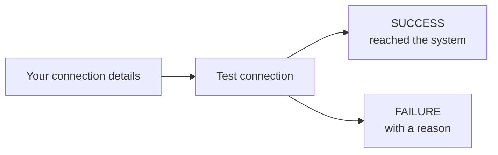
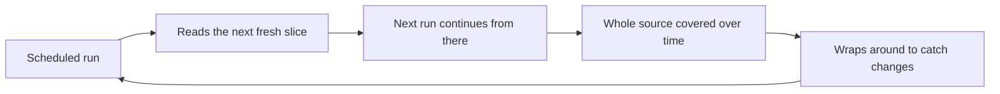

# Testing & Scheduling

Two things turn a configured source into a reliable, hands-off part of your
estate: **testing** that it connects, and **scheduling** it to scan on its own.

---

## Test the connection

Before committing to a full scan, you can **test the connection** to check that
the details you entered actually work — without reading any content or producing
findings. It's the fast way to catch a typo'd host, an expired token, or a
permission problem.

A test returns one of two clear outcomes:

| Result | Meaning |
|---|---|
| **Success** | Classifyre reached the system and authenticated. You'll get a short confirmation message (e.g. *"Successfully connected to Slack workspace acme."*). |
| **Failure** | Something's wrong, with a human-friendly message pointing at the likely cause so you can fix it. |

**Why it's especially useful here:** because secrets are
**[masked](/sources/configuration/)** (write-only and never shown back), testing
is the proper way to confirm a credential is correct — you verify it *works*
rather than trying to re-read it.

> Test right after creating a source, and again whenever you rotate a credential
> or change connection details. A quick test now saves a failed scan later.

---

## Scan on a schedule

A source can scan **on a recurring schedule** so coverage stays current with no
one having to remember to press a button.

Scheduling has three parts:

| Setting | What it does |
|---|---|
| **Enabled** | Turns the recurring schedule on or off. |
| **Cadence** | When to run, as a standard cron expression (e.g. every night, every weekday morning). |
| **Timezone** | The timezone the cadence is interpreted in (defaults to UTC). |

You can still run a scan **manually** at any time — the schedule simply adds
automatic runs on top.

### Scheduling + Automatic sampling = effortless coverage

Recurring scans are most powerful paired with the **Automatic**
[sampling strategy](/sources/sampling/):

Each scheduled run reads a bounded slice, picks up where the last one stopped,
and — over several runs — covers the entire source, then loops back to catch what
changed. A little, often, automatically.

---

## What happens after a scan

Testing and scheduling get a source running; the rest of the platform takes it
from there:

- **[Flow](/flow/)** — what a scan does step by step, and how repeat scans diff
  against the previous run.
- **[Investigations](/flow/investigations/)** — how findings become inquiries and
  cases.
- **[Autopilot](/flow/investigations/autopilot/)** — the AI agents that act on new
  findings after each scan, and can even tune a source's detectors for you.

---

## Keep going

| Page | |
|---|---|
| [How Sources Work](/sources/how-it-works/) | What a source is and its journey to findings |
| [Configuration & Fields](/sources/configuration/) | Required, masked, and optional fields |
| [Sampling Strategies](/sources/sampling/) | How much to read, and which items |
| [OCR & Transcription](/sources/content-extraction/) | Reading images, audio, and video |
| Testing & Scheduling | Verify connections and automate scans *(you are here)* |
| [Assets & Metadata](/sources/assets-and-metadata/) | What a scan produces |

See what a scan actually yields in
**[Assets & Metadata](/sources/assets-and-metadata/)**, or look up a specific
system's exact fields in the **[Source Catalog](/sources/)**.
