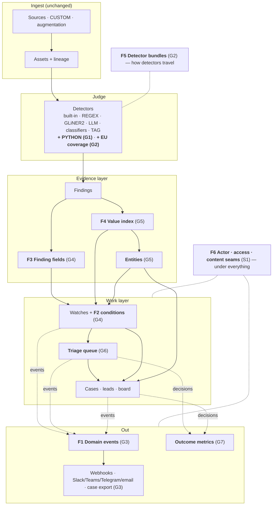
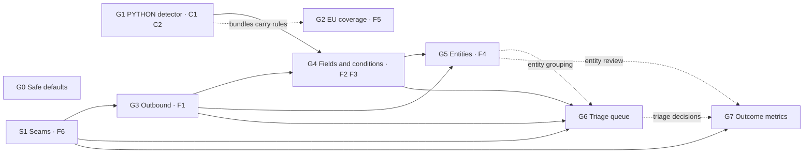

# How the PRDs fit together

*Read this first. It explains how the nine PRDs in this folder add up to one product change instead of nine standalone features. Background: [palantir-use-case-gap-analysis.md](../../palantir-use-case-gap-analysis.md).*

## 1. The principle

Each PRD closes one gap, but most gaps share machinery:
- A webhook, a triage queue, a metric and an enterprise audit trail all need to know *what happened*.
- A watch, a case filter, a search, an export and a queue all need to ask *which findings qualify*.
- A Python rule, an LLM extraction and a watch condition all need the same *typed values*.

If each PRD builds its own version, we ship nine features that can't talk to each other and four subtly different rule languages.

So the program is built as **seven shared foundations (F1–F7)**. Each is owned by exactly one PRD and consumed by the others through a written **contract (C1–C7)**. A feature is "done" only when it produces and consumes those contracts, not when its own screen works.

## 2. The picture

Read it top to bottom. Nothing in *Ingest* changes. *Judge* gains two capabilities. The *Evidence layer* gains typed values, a shared value index and entities. The *Work layer* gains one condition language and a queue. *Out* is new. S1's seams run under the work and out layers, so the enterprise edition can later plug in without touching feature code.

## 3. Shared foundations

### F1 Domain events

| | |
|---|---|
| **What** | Append-only, per-workspace table `domain_events`, written in the same transaction as the change, then dispatched to subscribers |
| **Owner** | [G3](G3-outbound-webhooks-notifications-export.md) |
| **Producers** | every PRD, plus the 13 existing notification call sites (bridged by `NotificationsService`, G3 E4) |
| **Consumers** | webhooks and channels (G3); enterprise audit (through S1 extension modules); optionally the G7 digest |
| **Rule** | Events are **aggregate-level**. Never emit one event per finding at scan volume |

**Event catalogue v1.** Existing notification events keep their names, so nothing is renamed.

| Type | Producer | Subject | Key data |
|---|---|---|---|
| `scan.completed` *(new)* | run finalisation (`cli-runner`) | runner | source, assets created/updated/deleted, findings new/resolved, warnings |
| `scan.failed`, `scan.recovered` | existing | runner | as today |
| `findings.spike`, `findings.mass_resolved` | existing | source | as today |
| `source.first_scan`, `source.config_changed`, `source.autopilot_rescan`, `source.schedule_paused`, `source.schedule_changed` | existing | source | as today |
| `inquiry.new_matches` | existing (matching service) | inquiry | new and gone counts, top severity, up to 10 sample finding ids |
| `inquiry.threshold_crossed` *(new)* | G4 | inquiry | count, window |
| `case.created`, `case.status_changed` *(new)* | cases service | case | from/to status, severity |
| `case.escalated`, `case.findings_escalated` | existing | case | as today |
| `case.exported` *(new)* | G3 | case | format, redact flag |
| `lead.proposed` *(new)* | case-leads refresh | case | counts by origin |
| `triage.items_created`, `triage.item_decided`, `triage.overdue`, `triage.flood` *(new)* | G6 | inquiry / triage item | counts, decision |
| `entity.created`, `entity.merged`, `entity.candidates_pending` *(new)* | G5 | entity | counts |
| `detector.created`, `detector.updated`, `detector.imported`, `detector.exported` *(new)* | G1, G2 | detector | key, type, version, bundle |
| `content.revealed` *(new)* | S1 | finding | purpose (only in modes that ask for it) |
| `outcomes.digest` *(new, optional)* | G7 | workspace | weekly summary |

Payload schemas live in `packages/schemas/src/schemas/domain_events.json`. The webhook envelope (C4) wraps them.

### F2 Condition language

| | |
|---|---|
| **What** | One JSON grammar (`{ all: [ { field, op, value } ] }`) with one parser, one SQL compiler and one in-memory evaluator, in `apps/api/src/conditions/` |
| **Owner** | [G4](G4-extracted-values-and-watch-conditions.md). It generalises the existing `assets/asset-metadata-predicate.ts` |
| **Consumers** | watches, case filters, finding search, CSV and live query (G4); triage queues (G6 queues *are* watches); entity watches (G5 enables the `entity` field); `ctx.query_assets()` and asset search keep using the metadata part |
| **Rules** | Fail closed: HTTP 400 naming the leaf. SQL and in-memory must agree, enforced by a conformance spec. Conditions add *what*, never *when*: newness stays with run anchors |

### F3 Finding fields

| | |
|---|---|
| **What** | Typed table `finding_fields` (text, number, boolean, date) for every extracted value |
| **Owner** | [G4](G4-extracted-values-and-watch-conditions.md) |
| **Writers** | LLM output fields, GLiNER2 structured extraction, PYTHON `fields` (G1), all through **one** writer in bulk ingest |
| **Readers** | conditions (F2), search, exports, entity attributes (G5), case export (G3) |
| **Contract** | **C3** `DetectorOutputField` (`name`, `type`, `description`), shared by LLM and PYTHON detector schemas |

### F4 Value index

| | |
|---|---|
| **What** | `asset_correlation_values`: every normalised finding value per asset, exact and phonetic, already maintained by the correlation engine |
| **Owner** | [G5](G5-entities.md), which splits *value indexing* from *duplicate scoring* so the index lives on when duplicates are switched off |
| **Writers** | the correlation normaliser; PYTHON findings with `normalized_value` (G1, contract **C2**); new identifier labels from G2, which are non-phonetic by catalogue (G2 A7) |
| **Readers** | duplicates (unchanged), `get_value_occurrences`, recurrence conditions (F2), entity mentions (G5) |

### F5 Detector bundles

| | |
|---|---|
| **What** | `classifyre.detector-bundle/v1`: a portable JSON file holding one or more detectors with test scenarios, provider requirements and quality metadata |
| **Owner** | [G2](G2-eu-detection-coverage.md) |
| **Producers** | export from any instance; `packages/detector-packs/*` in the repository; the starter-example catalogue |
| **Consumers** | import (with dry run, conflict policy and a post-import test run). PYTHON detectors (G1) are imported **inactive** |
| **Rule** | Uses the same credential guard as namespace transfer: secrets never leave |

### F6 Actor, access and content seams

| | |
|---|---|
| **What** | `ActorContextService` (who), `ACCESS_POLICY` (may they), `FindingContentPresenter` (what they see), and extension-module loading |
| **Owner** | [S1](S1-enterprise-extension-seams.md) |
| **Consumers** | every new endpoint in G1–G7: `createdBy`, `decidedBy` and `@Access(...)` on routes; the presenter for any content leaving the process (webhooks, exports, entity pages) |
| **Rule** | Open-source defaults reproduce today's behaviour exactly |

### F7 Surface parity

Every capability ships on **all** surfaces, or explicitly documents why not. The checklist is §8.

## 4. Build order and milestones

Solid arrows are hard dependencies; dotted arrows add value when present.

| Milestone | PRDs | What can be demonstrated at the end |
|---|---|---|
| **M0 · Safety and seams** | [G0](G0-safe-defaults.md), [S1](S1-enterprise-extension-seams.md) | The Docker image behind its password gate; the "no login" banner. Internally: actor, policy and presenter in place with no visible change |
| **M1 · Extensibility** | [G1](G1-python-detector.md), [G3](G3-outbound-webhooks-notifications-export.md) | A GENESIS integrity check as a PYTHON rule with row locations. Its inquiry posts to Slack; a webhook reaches n8n; the case exports as Markdown |
| **M2 · Europe** | [G2](G2-eu-detection-coverage.md) | The EU/EEA preset finds French, Dutch and Belgian IDs with checksums. The GDPR Art. 9 pack imports from a bundle with its tests; a detector moves between two instances |
| **M3 · Structured signals** | [G4](G4-extracted-values-and-watch-conditions.md) | Supplier emails, then LLM extraction, then a watch `delay_days > 7`, then a threshold alert in Teams |
| **M4 · Entities** | [G5](G5-entities.md) | One page for ACME across the Firmenbuch register and mail. "Watch this entity"; the entity on the case board |
| **M5 · Workflow and proof** | [G6](G6-triage-queue.md), [G7](G7-outcome-metrics.md) | An Art. 9 queue worked by keyboard; the Outcomes page with precision per detector and a baseline comparison |

**Relative sizes:** G0 XS–S · S1 S–M · G1 M · G2 S–M · G3 S–M · G4 M · G5 L · G6 S–M · G7 S.

**Parallelism.** M0 is small and unblocks everything. G1 and G3 are independent. G2 Parts A and B don't depend on anything and can run alongside M1. G4 needs G1's contract C1, or introduces it itself.

## 5. Cross-feature contracts

| Id | Contract | Defined in | Introduced by | Used by |
|---|---|---|---|---|
| **C1** | `identity_key` on `DetectionResult`: when present, `detectionIdentity` is derived from it instead of the matched content (`apps/api/src/utils/detection-identity.ts`) | `single_asset_scan_results.json` | G1 (or G4 if it ships first) | PYTHON rules, LLM extraction findings (G4 A2) |
| **C2** | `metadata.normalized_value` on findings: the value that enters the value index; findings without it (PYTHON) stay out | G1 §6.3 | G1 | F4, G5 |
| **C3** | `DetectorOutputField { name, type: string\|number\|boolean\|date\|list[…], description }` | `all_detectors.json` | G1 / G4 | LLM, PYTHON, F3 writer, condition catalogue |
| **C4** | Event envelope `classifyre.event/v1` (id, type, occurredAt, namespace, actor, subject, severity, data) | `domain_events.json` | G3 | webhooks, channels, audit |
| **C5** | Detector bundle `classifyre.detector-bundle/v1` | `detector_bundle.json` | G2 | import/export, packs, examples |
| **C6** | Case export `classifyre.case-export/v1` | `case_export.json` | G3 | export, archive, future re-import |
| **C7** | Condition JSON (F2 grammar and field catalogue) | `conditions.json` | G4 | watches, filters, search, exports, queues, MCP |

All schemas live in `packages/schemas/src/schemas/`. The web, API and CLI consume the same files; that is how the monorepo already keeps sources and detectors consistent across three languages.

## 6. End-to-end scenarios (program acceptance)

These are the tests that prove the PRDs work *together*. Each becomes a Playwright suite in `apps/e2e/tests/` as its milestones land.

### Scenario A: the European DPO (M0–M5)

1. Run the all-in-one image with the password gate (G0).
2. Connect Microsoft 365 and Confluence (existing connectors).
3. Enable the **EU/EEA** PII preset and import the **GDPR special categories** bundle (G2).
4. Add a PYTHON rule "special-category document shared widely": `needs_findings` plus asset metadata `shared_with_count > 50` (G1).
5. Create a watch with the conditions `finding.type matches ^gdpr_art9:` and `asset.metadata.shared_with_count gt 50` (G4), in **queue** mode with an SLA of 48 h (G6), subscribed to a Teams channel (G3).
6. The scan runs. The queue fills, grouped per asset, and Teams gets `triage.items_created`.
7. The reviewer accepts two items into a case (G6), creates an entity for the data subject from a finding (G5), and exports the case, redacted, for the DPO (G3).
8. The Outcomes page shows precision of the Art. 9 detector and time to decision against the baseline saved in step 3 (G7).

### Scenario B: public statistics integrity (M1, M3, M5)

1. GENESIS CUSTOM sources (existing).
2. `de_dq_no_total_row` re-implemented as a PYTHON rule. Findings carry `{expected, actual, deviation_pct}` and row locations (G1).
3. A watch on `extracted.de_dq_totals.deviation_pct gte 20` with a volume threshold of 10 in 7 days (G4).
4. `inquiry.threshold_crossed` is delivered to a newsroom webhook with a valid signature (G3).
5. Rule precision appears after a week of reviews (G7).
6. The old TAG detector is retired, and its findings resolve through `cleanup_removed_detector_findings`.

### Scenario C: company investigation (M4)

1. The Firmenbuch CUSTOM source declares entities through `Asset(entity=…)` (G5 R12).
2. A mail source's PII `ORGANIZATION` findings link exactly to the company entities. Spelling variants appear as candidates (G5).
3. The entity page shows co-mentioned people. The investigator adds the entity to a case; `ENTITY` leads propose new mail.
4. The case exports with entity evidence and identifiers (G3).

## 7. Touchpoints by PRD

| PRD | Prisma (tenant schema) | CLI | API module | Web | MCP group | Emits |
|---|---|---|---|---|---|---|
| G0 | — | — | instance settings | banner, docs | — | — |
| S1 | — (extension tables live in modules) | — | `identity/` | `useActor`, `<Can>` | all tools mapped to actions | `content.revealed` |
| G1 | `custom_detector_files`, `notebook_executions` columns, test-scenario `inputAsset` | `detectors/python/`, pipeline hook, shared payload server | custom detectors, notebook, detection identity | Python rule editor, preview, tests | `custom_detectors` + `custom_source_code` | `detector.*` |
| G2 | — | `detectors/pii/recognizers/eu/` | bundle import/export | PII presets, import/export dialog | `custom_detectors` | `detector.imported/exported` |
| G3 | `domain_events`, `webhook_*`, `notification_channels`, `channel_deliveries` | — | `integrations/`, case export | Settings › Integrations, export dialog | `integrations`, `cases` | `case.exported`, bridge for all |
| G4 | `finding_fields`, `inquiries.conditions/alert`, filter kind `CONDITION` | LLM/GLiNER2 `emit` | `conditions/`, matching, search, export | condition builder | `inquiries`, `findings`, `extractions` | `inquiry.threshold_crossed` |
| G5 | glossary columns, `entity_values` | `Entity` in the SDK | `entities/`, correlation split | entity page, review queue | `entities` | `entity.*` |
| G6 | `triage_items`, inquiry queue columns | — | `triage/` | `/triage` | `triage` | `triage.*` |
| G7 | `decision_log`, `outcome_stat_daily`, `outcome_baselines`, `cases.closed_at` | — | `outcomes/` | Outcomes page, cards | `metrics` | `outcomes.digest` |

## 8. Engineering rules for this codebase

These come from the code and from incidents already paid for. Every PRD's implementation follows them.

| # | Rule | Why / where |
|---|---|---|
| 1 | Every new table lives in the **tenant schema**. Migrations run per tenant (`prisma migrate deploy` with a `search_path`, `apps/api/src/database-migrations.ts`). Schema-qualify extension types | Multi-tenancy is schema-per-namespace |
| 2 | **Never edit an applied migration.** Always add a new one | `migrate deploy` does not re-check applied migrations, so an edit silently drifts every tenant schema |
| 3 | Run Prisma, ESLint and codegen on **Node 22**. `bun lint` in `apps/api` is a CI gate (`require-await` and friends are errors) | Tooling requirements |
| 4 | There is **no global ValidationPipe**, so DTO decorators don't run at request time. Validate and normalise in services, fail closed on unknown keys, and use `strictObject` in MCP zod schemas | `main.ts` registers no global pipe; finding filters already fail closed |
| 5 | After OpenAPI codegen, add every new DTO by name to the `export type {…}` block in `packages/api-client/src/client.ts` | That block is a selective re-export |
| 6 | Every MCP tool belongs to a capability group (`mcp-catalog.ts`). `mcp-catalog.completeness.spec.ts` must pass | Tokens are scoped by group |
| 7 | Every link follows the **namespace URL contract** (`host/<namespace>/<path>`): web, events, emails, exports | Links must work in every workspace |
| 8 | Queues are pg-boss, registered per namespace through the worker-queue registry. Coalescing jobs must account for completed jobs holding their singleton slot. **Persist** counters and breakers | `clearForSchema` wipes per-namespace in-memory state whenever namespace workers are torn down |
| 9 | Backfills over `findings` walk **`ctid` block ranges**, never primary-key keyset paging, and never an unbounded `findMany` | Past out-of-memory incidents; keyset paging on this table is random heap I/O |
| 10 | De-duplicate rows before `INSERT … ON CONFLICT`. Cast explicitly inside raw `VALUES` lists | One repeated key fails the whole statement; mocked Prisma won't catch type errors |
| 11 | Prefer typed columns over JSONB predicates for anything filtered at scale | JSONB predicates have produced 1-row estimates against 28k rows |
| 12 | Use a **value import** for any class injected with `@Optional()` | A type-only import yields an undefined injection |
| 13 | Every write endpoint is either blocked in demo mode or explicitly `@AllowInDemoMode()` | Demo mode is the public showcase's write protection |
| 14 | Every new table is added to `data-transfer/transfer-scopes.ts`, or listed in its "deliberately absent" comment with a reason | That registry is the single source of truth for archives |
| 15 | Every UI string has EN and DE keys (`apps/web/i18n/en.json`, `de.json`). Status pills use `lib/status-tone.ts` | The UI ships in two languages |
| 16 | New mutating autopilot tools respect `aiMode` (observe-only), write `AgentDecision` rows, and support undo where possible | Operator trust in the autopilot |
| 17 | Any matched content leaving the process goes through the content presenter ([S1](S1-enterprise-extension-seams.md)) | One place for enterprise redaction |
| 18 | Adding a Prisma model or enum can crash the dev watch-mode API and worker pods until they are restarted; plan dev rollouts for it | Dev stack behaviour |

## 9. Definition of done (every PRD)

- [ ] New migrations only. Applied on every tenant schema in dev; round-trip tested on an empty and a populated workspace.
- [ ] API module with spec tests. `bun lint` and `check-types` clean.
- [ ] OpenAPI regenerated; api-client export block updated.
- [ ] MCP tools in a capability group; completeness spec green; the generated MCP docs catalogue refreshed.
- [ ] Web UI with EN and DE strings and namespace-aware links.
- [ ] Demo-mode behaviour decided and tested.
- [ ] Data-transfer scope updated, or the exclusion documented with a reason.
- [ ] Domain events emitted per the catalogue (F1), with payload schemas in `packages/schemas`.
- [ ] Actor from `ActorContextService`, `@Access(...)` on routes, content through the presenter (F6).
- [ ] Human decisions write `decision_log` rows ([G7](G7-outcome-metrics.md)) where applicable.
- [ ] Docs pages in `apps/docs`, and release notes.
- [ ] The milestone's end-to-end scenario step passes in `apps/e2e`.

## 10. Open-source core and enterprise edition

| Capability | Open-source core | Enterprise edition (built for the first buyer, as a module through S1) |
|---|---|---|
| Access | Password gate, proxy recipes, "no login" banner (G0) | SSO (OIDC/SAML), users, namespace membership, roles |
| Identity | Self-declared or proxy-supplied name | Authenticated identity on every row |
| Content | Full content, through the presenter | Redaction by role; reveal logging |
| Events | Outbox, webhooks, channels (G3) | Audit trail with long retention and export |
| Case export | Markdown and JSON (G3) | PDF, regulator/SAR/DSAR templates, signing |
| Triage | Queues with free-text assignee (G6) | Users, teams, SLA escalation |
| Metrics | Outcomes and baselines (G7) | Per-user and per-team productivity; cost and ROI reports |
| Detectors | All engines including PYTHON; bundles (G1, G2) | Signed bundles; an approval workflow for PYTHON code |

## 11. Terms

| Term | Meaning in code |
|---|---|
| Workspace | Namespace (`ns_<uuid>` schema) |
| Watch | `Inquiry` (the UI calls it an Inquiry Watch) |
| Run | `Runner` |
| Value index | `asset_correlation_values` |
| Entity | `GlossaryTerm` with `entity_values` (G5) |
| Finding fields | `finding_fields` (G4) |
| Domain event | `domain_events` row (G3) |
| Bundle | `classifyre.detector-bundle/v1` file (G2) |
| Condition | F2 JSON (G4) |
