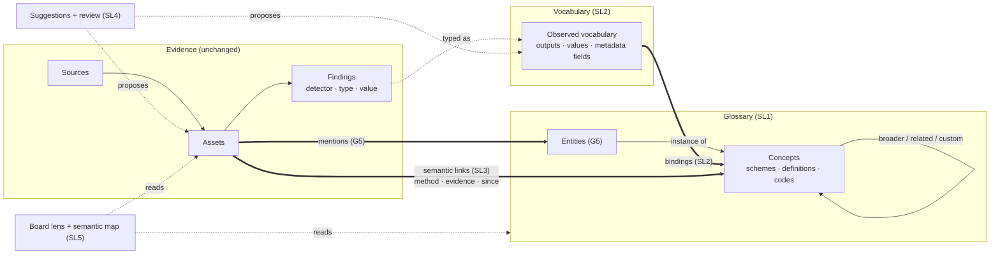
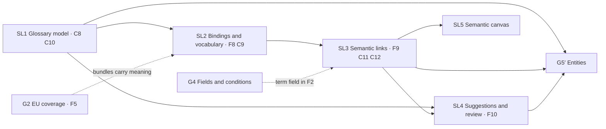

# SL0 · The semantic layer: how the PRDs fit

*Read this before SL1–SL5. Background: [the glossary research](../research/glossary-semantic-layer.md). This set extends [how the PRDs fit together](00-integration-architecture.md); its rules, contracts and definition of done apply unchanged unless this document says otherwise.*

| | |
|---|---|
| **Status** | Draft for review |
| **Date** | 2026-10-01 |
| **PRDs** | [SL1 Glossary model](SL1-glossary-model.md) · [SL2 Bindings and vocabulary](SL2-bindings-and-vocabulary.md) · [SL3 Semantic links](SL3-semantic-links.md) · [SL4 Suggestions and review](SL4-suggestions-and-review.md) · [SL5 Semantic canvas](SL5-semantic-canvas.md) |
| **Changes** | G5 (Entities) is amended (§9). The case-board PRD's non-goal "no entity nodes" is lifted. Roadmap Phase 4 ("Data Concepts") is superseded |

## 1. Why

**Today.** The glossary is vocabulary for agents, not semantics for the data:
- Agents read it in their prompt and look terms up.
- Nothing in the evidence flow reads it: detectors, findings, watches, search, lineage, case board and exports all ignore it.
- No screen lets a person link a finding to a term.
- It mixes business concepts with named entities in one list.

**The change.** This program connects meaning to evidence. A **semantic link** says what a piece of evidence means and how we know:
- its **method**;
- its **evidence**;
- who **approved** the rule behind it;
- a **lifecycle** (when it appeared, and when it went).

It is lineage for meaning, not a tag.

The research covers the full current state, the evidence index and the options considered.

## 2. Decisions

These were taken with the product owner on 2026-10-01. Do not reopen them during implementation; raise concerns with the owner instead.

| # | Decision | Consequence |
|---|---|---|
| D1 | **One glossary, two kinds:** CONCEPT (business term) and ENTITY (named thing) | They share aliases, lookup, embeddings, review and MCP tools. Entities point to concepts with INSTANCE_OF. G5 builds on the ENTITY kind (§9) |
| D2 | **Semantic links, not tags** | Every link has a method, a confidence, evidence and a lifecycle. Links are derived from evidence or made by a person, never asserted silently |
| D3 | **Linking in v1:** bindings, connector declarations, semantic suggestions. **No separate GLOSSARY detector** | Bindings map detector outputs to meaning. They are built from the **observed** vocabulary (types and values with counts), **not from regex**. Connectors can declare meaning (`Ref.term`). Embedding suggestions feed a review queue |
| D4 | **Ontology depth:** taxonomy and relations (BROADER, RELATED, PART_OF, INSTANCE_OF, custom verbs between concepts) | No properties, functions or actions in v1. Facts about particular entities stay in `edges` |
| D5 | **Canvas:** a case-board *Meaning* lens and a workspace semantic map | SL5 |
| D6 | **Order:** the semantic foundation first; G5 on top in M4 | §6 |
| D7 | **Agents may approve their own bindings and relations** in MANAGED mode, with an impact preview, a decision log, undo and budgets | Terms, aliases and individual links stay proposals that an operator decides. Agents never change operator-approved items |
| D8 | **Starter packs, CSV and SKOS JSON-LD** | SL1 (formats), SL2 (packs with bindings) |
| D9 | **Names:** "Glossary" stays the curation page; "Meaning" is the label on findings, assets and the board; the canvas is the "Semantic map" | Not asked explicitly; recommendation adopted. Cheap to revisit before the UI work starts |
| D10 | **Text-only concepts:** a "Find in text" action generates an ordinary REGEX custom detector from a term's labels, already bound to the term | No new detector engine. The generated detector gets tests, scope, feedback and the scan cache (SL2) |

## 3. The model

| Word | Meaning | Backed by |
|---|---|---|
| **Term** | One glossary entry, of kind CONCEPT or ENTITY | `glossary_terms` |
| **Concept** | A business term: *Bank account*, *GmbH*, *Health data* | term, kind CONCEPT |
| **Entity** | A named thing: *ACME Holding GmbH*, *Jane Doe* | term, kind ENTITY (G5) |
| **Scheme** | A vocabulary a concept belongs to: *Rechtsformen*, *GDPR personal data* | `glossary_schemes` |
| **Relation** | Curated structure between terms: taxonomy and concept-level verbs | `glossary_relations` |
| **Vocabulary item** | Something a detector or connector says: a detector output, or an asset metadata field | `vocabulary_items`, `vocabulary_fields` |
| **Binding** | "This vocabulary item (optionally with these values) means that concept" | `glossary_bindings` |
| **Semantic link** | "This asset is about that term", with method, support and lifecycle | `asset_terms` |
| **Method** | How a link was derived: BINDING, DECLARED, MANUAL, SUGGESTED, MENTION (G5) | `asset_terms.method` |
| **Proposal** | Anything waiting for a decision: a draft term, alias, binding, relation or suggested link | Draft rows plus `semantic_suggestions` |
| **Meaning** | The UI name for the links on a finding, asset or case | — |

## 4. Shared foundations

The integration architecture defines F1–F7. This program adds three; each is owned by one PRD.

### F8 Vocabulary inventory (the observed data dictionary)

| | |
|---|---|
| **What** | One rollup row per source and detector output, with open counts, distinct-value counts and top values; the same for asset metadata fields |
| **Owner** | [SL2](SL2-bindings-and-vocabulary.md) |
| **Consumers** | The binding dialog (smart defaults, value pickers), *Unbound vocabulary* (SL2), suggestions (SL4), the map's unbound lane (SL5), semantic coverage (G7) |
| **Rule** | Refreshed per source after a run, coalesced. Never computed live on page load |

### F9 Semantic links (the semantic lineage)

| | |
|---|---|
| **What** | `asset_terms`: one row per asset × term × method, with support count, a representative finding, maximum severity, confidence, first and last linked time, and when it went |
| **Owner** | [SL3](SL3-semantic-links.md) |
| **Writers** | Only the semantic linker. It applies bindings, declarations, manual links and accepted suggestions; G5 adds MENTION |
| **Readers** | Search and filters, watches, the term page, Meaning cards, the board lens and the map (SL5), exports, G5, G6 grouping, G7 coverage |
| **Rule** | No row per finding. Finding-level answers are resolved on read from the binding, the declaration or the manual link |

### F10 Review queue

| | |
|---|---|
| **What** | One queue for every proposal: draft terms and aliases, draft bindings and relations, machine suggestions (bindings, relations, asset links). G5 adds entity mentions and merges |
| **Owner** | [SL4](SL4-suggestions-and-review.md) |
| **Rule** | A proposal is inert until decided. Dismissals are remembered, so the same proposal does not return unless its evidence changes materially |

### Use of the existing foundations

| Foundation | Use |
|---|---|
| F1 Domain events | `glossary.term_changed`, `glossary.relation_changed`, `glossary.binding_changed`, `glossary.imported`, `semantic.links_updated`, `glossary.proposals_pending`. All aggregate-level |
| F2 Condition language | When G4 lands, F2 gains a `term` field (with `includeNarrower`) for watches, filters and exports. Bindings are not conditions (rule SL-7) |
| F3 Finding fields | Not used in v1. Concept properties (D4 option B) would bind to them later |
| F4 Value index | G5's mention linking only. Concepts don't need it |
| F5 Detector bundles | A bundle may carry a `glossary` section in the C10 format, so a detector pack ships its meaning |
| F6 Seams | Steward, approver and decider come from `ActorContextService`. Routes carry `@Access(...)`. Matched content shown in Meaning cards goes through the presenter |
| F7 Surface parity | Every capability on web, REST and MCP, and in autopilot where §8 allows |

## 5. Contracts

All schemas live in `packages/schemas/src/schemas/`.

| Id | Contract | File | Introduced by | Used by |
|---|---|---|---|---|
| **C8** | **Term reference.** `key` matches `^[a-z0-9][a-z0-9._-]{0,99}$` and is unique in a workspace. URN: `term://glossary/<key>`. SDK: `Ref.term(key)`. A renamed key keeps its old value in `previousKeys`, and references keep resolving | `glossary_term_ref.json` | SL1 | SL2 packs, SL3 declarations, G5 |
| **C9** | **Binding spec:** `{ mode, output?, field?, values?, lookup?, termKey?, sourceIds? }` (SL2 §6) | `glossary_binding.json` | SL2 | REST, MCP, packs, SL4 suggestions |
| **C10** | **Glossary pack** `classifyre.glossary-pack/v1`: schemes, terms, relations, bindings. It may be embedded in a C5 detector bundle as `glossary` | `glossary_pack.json` | SL1 (terms), SL2 (bindings) | Import/export, starter packs, G2 bundles |
| **C11** | **Meaning DTO:** `{ term: {id, key, name, kind, scheme}, method, confidence, support, binding?, declaredBy?, linkedBy?, since, goneAt? }` | `semantic_link.json` | SL3 | Web, MCP, exports, case export (G3) |
| **C12** | **Graph extensions:** node type `term`; pending endpoint type `term_ref`; relation type `MEANS` (class REFERENCE); trace kind `meaning`; board item kind `TERM`; board op `term.place` | `case-board.ts`, graph DTOs | SL3, SL5 | Board, trace, MCP board tools, G5 |

## 6. Build order and milestones

Solid arrows are hard dependencies; dotted arrows add value when present.

| Milestone | Existing PRDs | Semantic layer | What can be demonstrated |
|---|---|---|---|
| **M1** | G1, G3 | **SL1** | Concepts and entities in separate tabs, a taxonomy tree, SKOS import of a scheme, a term page. The overclaiming texts fixed |
| **M2** | G2 | **SL2**, **SL3** | Install the *Personal data* pack and scan: findings show their meaning, the term page lists evidence, *Watch Health data* works. One lookup binding turns every Firmenbuch `legal_form` code into the right concept without a re-scan. "Find in text" for *Eigenmittelquote* |
| **M3** | G4 | **SL4**, **SL5** | The review queue fills with binding and document suggestions. The case board's Meaning lens shows terms beside the evidence. Discovery → Meaning draws the semantic map with a case overlay |
| **M4** | G5′ | — | Entities as ENTITY terms with mentions, shown in the same lens, map and queue |
| **M5** | G6, G7 | — | Queues grouped by concept; semantic coverage on the Outcomes page |

**Relative sizes:** SL1 S–M · SL2 M · SL3 M · SL4 M · SL5 M–L.

**Parallelism:**
- SL1 has no dependencies.
- SL2 and SL3 are built together against contracts C9 and C11 by two streams: binding UX and vocabulary on one side, linker and surfaces on the other.
- SL4 and SL5 run in parallel once SL3's rollup exists.

## 7. End-to-end scenarios (program acceptance)

These continue the integration architecture's scenarios A–C. Each becomes a Playwright suite in `apps/e2e/tests/` as its milestone lands.

### Scenario D: register semantics (M1–M3)

1. A Firmenbuch CUSTOM source asserts `tags={"legal_form": "GES"}` (existing).
2. Import the *DACH company law* pack. Its *Rechtsformen* scheme carries codes (SL1, SL2).
3. Bind output `tag:legal_form` in mode *Each value names a term* → scheme *Rechtsformen*. The preview shows the value-to-term table and lists unmatched values (SL2).
4. Save. The backfill links every record without a re-scan. The term page *GmbH* shows the records, with *Kapitalgesellschaft* above it in the taxonomy (SL3).
5. *Watch GmbH* creates a watch with a term condition, and the next run's new records arrive as NEW matches (SL3).
6. On a case board, Meaning → Concepts shows *GmbH* beside the case's records. Pin it and highlight by concept (SL5).

### Scenario E: the data-protection officer's first scan (M2–M3)

1. Install the *Personal data* starter pack (SL2).
2. Scan Microsoft 365 with the PII detector.
3. Findings carry Meaning chips (*E-mail address* ⊂ *Contact data* ⊂ *Personal data*). The glossary page reports semantic coverage (SL3).
4. Discovery → Meaning shows the concepts sized by assets, with severity rings (SL5).
5. Export the assets CSV: every row carries its current concept keys (SL3).

### Scenario F: a text-only concept (M2–M3)

1. Create the concept *Eigenmittelquote* with the alias *equity ratio* (SL1).
2. Run "Find in text". It generates a REGEX detector whose test scenarios pass, binds it to the term and attaches it to the annual-reports source (SL2).
3. After the scan, the term page lists the documents that use either label (SL3).
4. Suggestions propose documents that discuss the idea without either word. The reviewer accepts two in bulk (SL4).

### Scenario G: an agent approves a binding, and an operator reverts it (M2–M3)

1. An LLM detector produces the unbound label `force_majeure`. The autopilot calls `glossary.preview_binding` and then `glossary.approve_binding` to *Force majeure* (SL2, D7).
2. A decision-log row and an undo entry exist. The binding shows "approved by agent".
3. The operator clicks *Revert*. The binding is disabled and its links go GONE on the next linker pass (SL3).
4. A second approval attempt on a binding whose impact exceeds the limit stays a proposal, with the reason shown (SL2).

## 8. Agents (D7)

| Item | Agent may | Operator |
|---|---|---|
| Term, alias | Propose (DRAFT) | Approve, edit, deprecate, delete |
| Relation | Propose. **Approve its own in MANAGED mode**, between APPROVED terms | Anything |
| Binding | Propose. **Approve its own in MANAGED mode** after a preview, within the impact limit and the daily budget | Anything, including revert |
| Manual link (finding, asset or case → term) | Propose | Create, remove |
| Suggestion from SL4 | Approve BINDING and RELATION suggestions (as above); never LINK suggestions | Decide all |

Guardrails, stored in `InstanceSettings`:

| Setting | Default | Meaning |
|---|---|---|
| `autopilotGlossaryApproveEnabled` | `true` (D7) | Agents may approve bindings and relations at all |
| `autopilotGlossaryApprovalsPerDay` | `20` | Approvals per workspace per UTC day |
| `autopilotBindingImpactLimit` | `5000` | Open findings a binding may touch and still be approved by an agent. `0` means no limit |

Every approval:
- writes an `AgentDecision` row (new actions `APPROVE_BINDING`, `APPROVE_RELATION`);
- writes an `AgentUndoEntry` with `revertKind: "restore_value"`, kept for as long as the existing undo retention;
- respects `aiMode` and the instance switches.

Agents never edit, disable or delete an item an operator approved; they propose an alternative instead.

## 9. Changes to existing PRDs

### G5 Entities → G5′

| G5 as planned | G5′ |
|---|---|
| "The glossary term becomes the entity" | **An ENTITY-kind term** is the entity. Concepts are never entities |
| Entity type grows from the six-value enum | `entityType` stays for normalisation rules (person names, organisations). Meaning comes from INSTANCE_OF a concept (*ACME* → *GmbH*) |
| `entity_values` maps a value hash to an entity | Unchanged. Mention linking also writes `asset_terms` rows with method MENTION (F9), so entities appear in the same term page, lens, map, filters and watches |
| Its own review queue, reusing the duplicate-review UX | **The SL4 queue (F10)**, with two new kinds: ENTITY_MENTION and ENTITY_MERGE |
| Entity page | The term page for an ENTITY, plus G5's sections: mentions over time and co-mentioned entities |
| Connectors emit edges to entity URNs | Through `Ref.term(key)` (C8). Entity-to-entity facts are `edges` with `term` endpoints. A board link between two TERM items promotes to such an edge |
| `Asset(entity=…)` (R12) | Takes a term key (C8) |
| "Watch this entity" | The SL3 term condition |
| Scenario C: "PII ORGANIZATION findings link exactly" | **Correction:** the PII detector emits no ORGANIZATION type (only PERSON, LOCATION, NRP and identifiers). Use GLiNER2 `entity:organization`, or add ORGANIZATION to PII as a G5 task |
| Auto-link exact aliases and URNs | Only for APPROVED entities. Aliases shorter than 4 characters never auto-link (the Firmenbuch lesson: names are data, and single-letter codes are everywhere) |

### Other documents

| Document | Change |
|---|---|
| G2 EU coverage | C5 bundles may embed a `glossary` section (C10). The GDPR Art. 9 pack ships concepts bound to its detectors |
| G3 Outbound | Catalogue additions from §4 (F1). Case export includes each piece of evidence's Meaning (C11) |
| G4 Fields and conditions | F2 field `term` with `includeNarrower`. SL3's interim watch dimension migrates with the other matcher dimensions |
| G6 Triage | Queue items can group by concept or entity |
| G7 Outcomes | Semantic coverage, meaning the share of open findings with at least one current link; human decisions on proposals write `decision_log` rows |
| S1 Seams | No change to the seams; consumed as in §4 |
| `CASE_BOARD_PRD.md` §2 non-goals | "Entity extraction… the domain stays asset / finding / hypothesis" is lifted for TERM items (SL5). Entity extraction itself remains G5 |
| `INVESTIGATION_ROADMAP.md` Phase 4 | Superseded: data concepts are glossary concepts, and concept ↔ asset links are semantic links |

## 10. Engineering rules for the semantic layer

These apply on top of the integration architecture's §8.

| # | Rule | Why |
|---|---|---|
| SL-1 | **Every link explains itself.** A link has a method and resolves to its evidence: findings, a declaration or a person | The product's promise is defensible conclusions |
| SL-2 | **No row per finding.** Meaning is rolled up per asset × term × method and resolved to findings on read | `findings` and `edges` already hold millions of rows |
| SL-3 | **Meaning never propagates along FLOW** in v1 | `edges.py` names this failure mode; marking propagation belongs to the enterprise edition |
| SL-4 | **Lineage, trace and the source map ignore `term` and `term_ref` endpoints** unless the `meaning` kind is asked for | A concept is a hub; it must not become a lineage hop |
| SL-5 | **Only APPROVED items drive linking.** DRAFT is visible but inert; DEPRECATED stops linking and keeps its history | Operator trust, and D7's guardrail |
| SL-6 | **Code refers to terms by key** (C8), never by name or id. Keys are redirect-safe | Packs, connectors and imports must survive a rename |
| SL-7 | **A binding never contains a regex.** Patterns belong in detectors; a binding maps vocabulary to meaning | Keeps one rule language (the integration architecture's §1 principle) and keeps bindings indexable |
| SL-8 | **Agents never modify operator-approved items** | Today's glossary gate, carried over |
| SL-9 | Curated tables (terms, schemes, relations, bindings) are **protected** datasets. Derived tables (`asset_terms`, the vocabulary inventory, suggestions, map rollups) are **cleanable and rebuildable** | Matches `maintenance.datasets.ts` |

## 11. Touchpoints by PRD

| PRD | Prisma (tenant schema) | CLI | API module | Web | MCP group | Emits |
|---|---|---|---|---|---|---|
| SL1 | `glossary_terms` columns, `glossary_schemes`, `glossary_relations`, `glossary_activities` | — | `glossary/` (extended), `glossary/import-export/` | Glossary tabs, tree, term page, import/export | `glossary` | `glossary.term_changed`, `glossary.relation_changed`, `glossary.imported` |
| SL2 | `glossary_bindings`, `vocabulary_items`, `vocabulary_fields`, `custom_detectors.generated_from_term_id` | — (REGEX unchanged) | `semantic/bindings/`, `semantic/vocabulary/`, `semantic/packs/` | Bind dialog, *Unbound vocabulary*, detector Meaning tab, "Find in text" | `glossary` | `glossary.binding_changed` |
| SL3 | `asset_terms`, `glossary_references.role`, `semantic_stats` | `Ref.term`, `means()`, augmentation `asset.means()` | `semantic/linker/`, `semantic/links/`; graph term resolution; matcher dimension | Meaning cards, term Evidence tab, filters, watch form | `glossary`, `findings`, `inquiries` | `semantic.links_updated` |
| SL4 | `semantic_suggestions` | — | `semantic/suggestions/` | Glossary → Proposals | `glossary` | `glossary.proposals_pending` |
| SL5 | `case_board_items.kind` + TERM, `term_graph_nodes`, `term_graph_links`, `term_graph_state` | — | `case-board/` semantic layer, `semantic/map/` | Board lens, term cards, Discovery → Meaning | `case_board`, `glossary` | — |

## 12. Definition of done

The integration architecture's §9 applies to every SL PRD, plus:
- [ ] The rules in §10 hold, and a spec test pins each one that code can break: SL-2, SL-4, SL-5, SL-7, SL-8.
- [ ] Every new term, binding or link surface shows *why*: method, evidence and approver.
- [ ] Docs: `apps/docs/app/how-it-works/glossary/page.mdx` rewritten for concepts, entities, bindings and links. The MCP catalogue description is accurate.
- [ ] The milestone's scenario (§7) passes in `apps/e2e`.

## 13. Out of scope for the whole program

- Concept properties, computed properties, functions, actions and write-back (D4).
- Propagating meaning through lineage (SL-3); that is enterprise-edition marking.
- A separate GLOSSARY detector engine (D3, D10).
- Multilingual labels as first-class fields; other languages stay aliases (SL1 open question).
- Reasoning or inference beyond taxonomy roll-up, for example OWL entailment.
