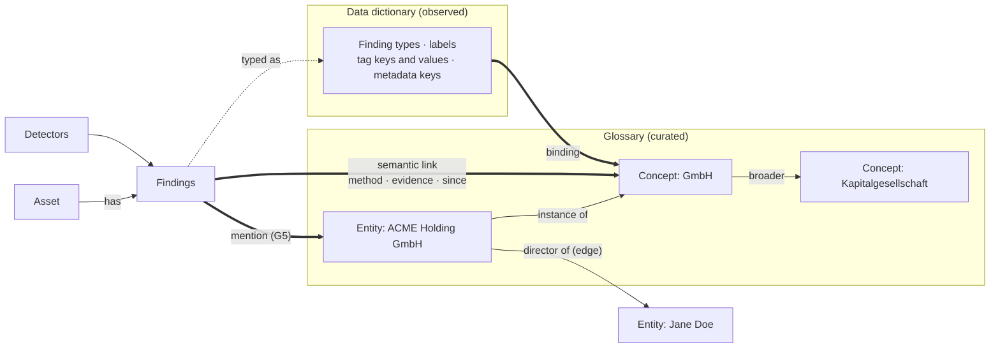

# The glossary, semantics and the ontology

*Research for the next step after [the gap analysis](../../palantir-use-case-gap-analysis.md) and [how the PRDs fit together](../prd/00-integration-architecture.md). Checked against `develop` (v0.6.4-SNAPSHOT) on 2026-10-01. Every claim about Classifyre points to code, a migration or a field report; see the evidence index at the end.*

**Question.** The business glossary doesn't seem to feed the ontology or the semantics of the product. Can it sit closer to the detector → finding → link/lineage flow, in the backend, the CLI and the UI, and give the case canvas an ontology view? Should it be lineage rather than a tag?

**Short answer.** Yes, and the instinct is right: a glossary term should be reached by **semantic lineage**, meaning links from evidence to meaning that carry their own proof. It shouldn't be a tag. Today the glossary is not connected to the evidence at all.

---

## The answer first

**The glossary is vocabulary for agents, not semantics for the data.** It holds canonical names with aliases:
- Agents get up to 20 of them in their prompt (the default cap) and look the rest up with a tool.
- Operators curate them on one page.
- No detector, finding, watch, search, duplicate score, lineage walk, case board or export reads it.
- No screen lets a person say "this finding is about that term".

**It mixes two different things.** One flat list with a six-value type holds:
- business concepts: *Eigenmittelquote*, *PKS 725000*, *FOIA exemption code*;
- named entities: *Hillary Clinton*, *Clinton Foundation*.

The field runs already split on this. The Firmenbuch run kept company names out of the glossary on purpose. The Clinton run put people in. G5 plans to make every term an entity, which settles the question the wrong way for concepts.

**Use semantic links, not tags.** A tag only asserts. A semantic link also says why. For example: this record is about *GmbH* because the register's `legal_form` tag says `GES`, and `GES` is the glossary code for *GmbH*, under a binding an operator approved. Like a lineage edge, the link carries:
- a method and a confidence;
- its evidence;
- a lifecycle: it goes away when its evidence does.

TAG keeps its job. It is a detector: the way a connector asserts a fact. The glossary says what that fact means.

**Most of the machinery already exists.**
- **Edges.** Their endpoint types are free-form, and a schema comment already makes room for "concept".
- **Embeddings.** Glossary terms, findings and chunks share one embedding space.
- **Matching.** The watch matcher and the metadata predicate already describe "which findings" and "which assets".
- **Runs.** Run hydration already ships TAG detectors to every CUSTOM or augmented run, and the scan cache already re-runs a single detector when only its config changed.
- **Canvases.** The case board has ghosts, trace kinds and hub caps. The source connection map shows how to draw a rollup canvas that stays small.

**What to build, in order:**
1. **Terms get a kind**, CONCEPT or ENTITY. Concepts get:
   - a definition, codes, a scheme, a steward and a status;
   - a taxonomy: broader/narrower and related.

   Also fix the four places that claim more than the code does (§1.4).
2. **Bindings.** Say once what a detector output means: a finding type, label, tag value or metadata value maps to a concept. Linking is retroactive, with no re-scan.
3. **Semantic links.** A per-asset rollup of which terms the evidence supports, how, and since when. Every surface reads it.
4. **Glossary detection.** A GLOSSARY pipeline that finds term names, aliases and codes in content and records them as findings.
5. **Surfaces:**
   - a term page;
   - *Meaning* on findings, assets and detectors;
   - filter and watch by term;
   - a semantic lens on the case board;
   - a workspace semantic map.
6. **Entities.** G5 builds them on the ENTITY kind and feeds the same links.

**What this is not.** No object types with editable properties, no functions, no actions, no write-back. Palantir's ontology is operational: you act on its objects. Classifyre's is evidentiary: every link points to the finding that justifies it. That is also what an auditor, a data-protection officer or a court asks for.

**Nine decisions are open** (§11). Each has a recommended option.

---

## 1. What the glossary is today

### 1.1 The model

| Field | Meaning |
|---|---|
| `term` (unique) | Canonical name |
| `aliases[]` | Other spellings and codes, matched by lookup |
| `proposedAliases[]` | Agent suggestions for an operator-owned term, kept out of lookup until accepted |
| `entityType` | `PERSON`, `ORGANIZATION`, `LOCATION`, `REFERENCE`, `TERM`, `OTHER` |
| `notes` | Free text |
| `origin`, `verifiedAt`, `verifiedBy` | Agent proposals stay unverified until an operator verifies them |
| `embedContentHash` | Term, aliases and notes, embedded in the shared vector store |

`glossary_references` links a term to the case, inquiry, source or finding that *established* it. It records provenance, not meaning.

How lookup behaves:
- It ranks exact term, then exact alias, then prefix, then substring (aliases included since GENESIS P10), then semantic neighbours.
- Operator deletions are remembered, so agents can't re-propose a deleted term.
- A machine-slug guard keeps agent memory keys out.

### 1.2 Who reads it and who writes it

| Consumer | Reads | Writes | Where |
|---|---|---|---|
| Glossary page (web) | List; filter by type | Create, edit, verify, bulk retype, delete | `glossary/page.tsx` |
| Agent system brief | The top 20 terms, verified first, in every run | — | `system-brief.service.ts:112`; `harnessMaxGlossaryEntries` default 20 |
| Autopilot tools | `glossary.lookup` | `glossary.propose`: unverified, and attaches the focused case as a reference | `glossary.toolset.ts` |
| Agent case detail | Terms that reference the case | — | `agent-search.service.ts:1176` |
| MCP | `list_glossary_terms`, `lookup_glossary` | `upsert_glossary_term` (no reference) | `mcp-server.factory.ts:873` |
| Embeddings | — | Term vector | `embedding-queue.service.ts:1126` |
| Data transfer, cleanup | Archived; listed as a protected dataset | — | `transfer-scopes.ts:686`, `maintenance.datasets.ts:132` |

### 1.3 What nothing reads

| Part of the evidence flow | Reads the glossary? |
|---|---|
| Detectors (CLI) | **No.** The CLI's only mention is a docstring in `graph/edges.py` |
| Finding ingest, value index, duplicates | **No.** `valueHash` is `sha256(label:value)`; aliases play no part |
| Watches (inquiry matcher) | **No.** Its dimensions are source, detector, custom key, type, type regex and value regex |
| Finding search, asset search, quick search | **No.** Search doesn't expand aliases |
| Graph, lineage, trace | **No.** Node types are `asset`, `finding` and `external` |
| Case board | **No.** Item kinds are evidence, hypothesis, comment, note and frame |
| Leads, exports, notifications | **No** |

People can't link either:
- The web never sends a reference.
- The REST API never returns one.
- MCP's upsert takes none.

Only the autopilot writes references, and only "this case established this term". **So nobody can currently link a finding to the glossary properly.**

### 1.4 What the product says it does

| Claim | Where | In code |
|---|---|---|
| "duplicate connections and inquiry matches read variant spellings correctly" | User docs, `how-it-works/glossary` | Neither reads the glossary |
| "The shared term glossary findings and detectors resolve abbreviations and jargon against" | MCP catalogue, `mcp-catalog.ts:320` | Nothing resolves against it |
| "inquiries, cases, fingerprints and glossary terms are all built on those findings" | Autopilot doctrine (`missions.ts:243`), the config toolset, `detection-impact.service.ts:63` | Terms are not built on findings. Disabling a detector changes nothing in the glossary |
| "a query for 'equity ratio' reaches records that only ever say *Eigenmittelquote*" | Firmenbuch case study | True only through semantic search, or through an agent that looks the term up first |

Fix the wording now, whatever is decided below. The doctrine matters most, because it teaches agents a dependency that doesn't exist. Once bindings ship (§6.3), the doctrine's sentence becomes true.

### 1.5 How it got here

| When | What | Migration |
|---|---|---|
| March 2026 | A BI-style semantic layer: `glossary_terms` with display name, category, a `filter_mapping` JSON, colour and icon, plus `metric_definitions` and dashboard placements | `20260326_add_semantic_layer` |
| June 2026 | Removed: terms and metrics both | `20260607000000_remove_glossary_terms`, `20260608000000_remove_semantic_layer` |
| July 2026 | Reintroduced as shared investigation vocabulary, seeded from agent memory | `20260716120000_add_memory_provenance_and_glossary` |
| August 2026 | References became many-to-many provenance | `20260810130000_remove_legacy_glossary_memory` |

Each attempt tied terms to something different:
1. **Filters and metrics**, as a BI semantic layer does. Nothing in the evidence flow used it, and it was removed.
2. **Agents.** It survived, but the data never learned about it.
3. **Evidence.** That should be the next attempt.

### 1.6 How the field used it

| Run | What went in | What it did | Source |
|---|---|---|---|
| Firmenbuch | 55 business terms with German, English and register codes: *Eigenmittelquote*; *Einzelvertretung* = `E`; *EUID*. **No company names**, on purpose | Lookup stopped depending on the analyst's language; single-letter codes resolve | Firmenbuch case study |
| GENESIS | Statistical concepts with codes: *Ausländerrechtliche Verstöße* = `PKS 725000` | Lookup by code, after P10 | GENESIS field report, P10 |
| Clinton e-mails | 17 entries, proposed by agents and verified by an operator: 9 people, 7 references, 1 organisation | "Part of the method": names, aliases, damaged spellings, release codes, institutional references | Clinton case study |
| Enron | Names proposed by agents (Tenaska, Kinder Morgan, FERC) | Judged "sensible"; the same agent's watches were mixed | Enron autopilot evaluation |

From the Firmenbuch write-up: *"Names are data, not terminology, and a glossary that learns entity names starts making the correlation engine confident about things it should be questioning."* Today nothing correlates on the glossary. G5, as written, would start doing that for exact aliases.

---

## 2. Dictionary, glossary, taxonomy, ontology, in Classifyre's terms

| Layer | Question | Classifyre today | Gap |
|---|---|---|---|
| **Data dictionary** | What data do we have? | Implicit and scattered, across: finding types (`IBAN_CODE`, `entity:organization`, `tag:legal_form`, `classification:risk:high`); LLM labels and output fields; TAG keys; asset metadata keys; table columns with column lineage | No list of the vocabulary the data actually uses. Nothing says what any of it means |
| **Business glossary** | What do these words mean? | Terms with aliases and notes | No definition, no codes distinct from aliases, no owner, no lifecycle, no link to the data |
| **Taxonomy** | How do we classify them? | Six entity types; detector categories (SECURITY, PRIVACY, …); finding `category` | No broader/narrower between terms |
| **Ontology** | What exists, how is it related, what can we do? | Assets, findings and typed edges with URNs (FLOW, CONTAINMENT, IDENTITY, REFERENCE, USAGE); cases, watches and escalations as the verbs | No concept or entity nodes. Nothing connects data to meaning |

What to take from Palantir, and where we stop on purpose:

| Palantir | Take | Leave |
|---|---|---|
| Object types (Customer, Order) vs objects (ACME, Order 123) | ✅ Concepts vs entities | Object types backed by datasets, with editable properties |
| Glossary, taxonomy and metadata as part of the ontology | ✅ One model | — |
| Link types and links | ✅ Concept relations (the schema) and entity edges (the facts) | — |
| Properties | 🟡 Later, if wanted: concept properties bound to typed finding fields (G4) | Computed or writeable properties |
| Actions, functions, write-back | — | ❌ Our verbs stay watch, case, escalate, export (G3) and triage (G6) |

---

## 3. Two kinds of term: concepts and entities

| | Concept | Entity |
|---|---|---|
| Examples | *Eigenmittelquote*, *Bank account*, *Health data (GDPR Art. 9)*, *Contract*, *GmbH* | *ACME Holding GmbH*, *Jane Doe*, *Clinton Foundation*, FOIA case F-2014-20439 |
| Answers | What does this mean? | Which one is it? |
| How it shows up in data | Finding types, labels, tag values, metadata, words and codes in text | Values: names, identifiers, URNs, e-mail addresses |
| Linked by | Bindings; glossary detection | Mentions in the value index: exact alias or URN automatically; phonetic and semantic matches as candidates |
| How many | Tens to a few thousand | Thousands to millions |
| Curated by | A steward, or a pack | Mostly derived, then reviewed |
| A wrong link means | A mislabelled class of data | The wrong person in a case |
| Structure | Broader/narrower, related | Instance of a concept; relations to other entities |

What they share: both answer "what is this about?", and both use aliases, lookup, embeddings, verification and review.

How they differ: how they link to data, and what a mistake costs.

Proposal: keep **one model, with an explicit kind and a different linking rule per kind**. That is decision D1.

---

## 4. Not a tag: semantic lineage

### 4.1 What TAG is

A TAG detector gives a connector's assertion a stable identity:
- `Asset(tags={"legal_form": "GES"})` becomes a finding `tag:legal_form` with the value `GES`.
- It never reads content.
- It is evidence, at the same level as a PII hit.

It is the right tool for "the register says so", and it stays.

It is not a definition. `GES` means nothing to anyone outside Austrian company law. Today the step from `tag:legal_form = GES` to *GmbH* happens in a person's head, or an agent's.

### 4.2 What a semantic link is

A semantic link says what evidence means, and how we know:

> **FN 606601k** (Firmenbuch record) → finding `tag:legal_form = GES` → **GmbH** (concept, scheme *Rechtsformen*) → broader **Kapitalgesellschaft** → broader **Company**
>
> - **Method:** the binding "legal_form values are Rechtsformen codes"
> - **Approved by:** an operator, on 2026-10-03
> - **Evidence:** 1 open finding
> - **Since:** run 412

This is lineage as this codebase already uses the word (`apps/cli/src/graph/edges.py`): a typed edge that records
- what traversing it means;
- how it was derived (method);
- how far to trust it (confidence);
- what it was read from (evidence);
- when it was last seen.

FLOW lineage answers "where did this data come from?". Semantic lineage answers "what is this data, and how do we know?".

| | Tag on an asset (catalogue style) | Semantic link |
|---|---|---|
| Says | "This asset is X" | "This asset is X *because of* finding F, through binding B" |
| Provenance | Who tagged it, maybe | Method, confidence, evidence, approver |
| When the evidence goes | The tag stays | The link goes with it |
| When the meaning changes | Re-tag by hand | Edit the binding; links recompute without a re-scan |
| Can be explained to an auditor | No | Yes, down to the page |

### 4.3 Rules carried over from lineage

- **Meaning doesn't travel along FLOW edges in v1.** `edges.py` names "PII tags travelling downstream through a join" as the failure to avoid, and the gap analysis puts propagating markings along FLOW in the enterprise edition. Show upstream evidence instead.
- **A semantic link is never a lineage hop.** It gets its own trace kind and stays out of the lineage view unless asked for.
- **No edges per finding at scan volume.** The `edges` table already holds millions of rows. Meaning is rolled up per asset and term, and resolved down to findings on read.

---

## 5. What already exists to build on

| Building block | How it helps | Where |
|---|---|---|
| Polymorphic edges with free-form endpoint types | Entity facts ("director of") can use `term` endpoints without a migration. A schema comment already makes room for "concept" | `schema.prisma:1420` |
| Roadmap Phase 4, "Data Concepts" | Already planned `fromType = 'concept'` and linking from findings ("PII + customer columns → Customer Data"). Never built | `INVESTIGATION_ROADMAP.md`, Phase 4 |
| Shared embedding space | Terms, findings and chunks are vectors in one space, so "term → nearest findings" is one query | `glossary.service.ts:541`; `embedding.service.ts` (`rowsForVector`, `semanticAssetIds`) |
| Value index, exact and phonetic | Entity mentions (G5) | `asset_correlation_values`, `value-normalizer.ts` |
| Inquiry matcher | The selector language bindings need: source, detector, key, type, type regex, value regex. Its SQL half and in-memory half are specified to agree | `matching/inquiry-matcher.ts` |
| Asset metadata predicate | Bindings on connector metadata, e.g. `legal_form_code eq "GES"` | `assets/asset-metadata-predicate.ts` |
| Run recipe hydration | Already ships every TAG detector to CUSTOM and augmented runs. The same place can ship a glossary snapshot | `cli-runner.service.ts:1345` |
| Scan cache fingerprints | A glossary edit re-runs only the glossary detector | `pipeline/scan_cache.py:121` |
| Keyword mechanisms | PII `deny_list` and the legacy `CustomKeywordRule` both show the need. Neither is tied to the glossary | `all_detectors.json` |
| Case board | React Flow; item kinds; ghosts; trace with kinds and hub caps; a view popover with highlight-by | `CASE_BOARD_PRD.md`, `packages/schemas/src/case-board.ts`, `graph-trace.ts` |
| Source connection map | A rollup canvas that stays small at two million assets: the template for a concept map | `stats/source-graph.service.ts`, `constellation.service.ts` |
| Cleanup and transfer registries | Protected vs derived data; archive scopes | `maintenance.datasets.ts`, `transfer-scopes.ts` |

---

## 6. Proposed model



### 6.1 Terms

New fields on `glossary_terms`:

| Field | Why |
|---|---|
| `kind`: CONCEPT or ENTITY | §3 |
| `key`: stable and unique | Used by bindings, packs, the SDK and URNs (`term://<key>`). Renaming a term doesn't break code that uses its key |
| `definition` | The authoritative meaning. `notes` stays as working notes |
| `codes[]` | Notations such as `GES`, `PKS 725000`, `HGB_224_3_A`. Matched case-sensitively, as whole tokens |
| `hiddenAliases[]` | Spellings used by lookup but never detected in text: `E`, common misspellings. SKOS calls this a hidden label |
| `schemeId` | The vocabulary the term belongs to: *Rechtsformen*, *GDPR special categories*, *PKS* |
| `status`: DRAFT, APPROVED or DEPRECATED | The lifecycle. Only approved terms drive linking |
| `steward` | Who answers for the definition. Free text until the enterprise edition has identities |
| `detection`: OFF, TERM or TERM_AND_ALIASES | Whether glossary detection looks for the term in text |

Existing rows migrate as follows:
- PERSON, ORGANIZATION and LOCATION become ENTITY; everything else becomes CONCEPT.
- Verified becomes APPROVED; unverified becomes DRAFT.
- A one-time banner lists how each row was classified, so an operator can correct it.

The shape follows W3C SKOS: preferred label, alternative label, hidden label, notation, definition, broader, related, concept scheme. That makes a glossary importable from and exportable to the vocabularies European public bodies already publish that way, such as EuroVoc and the EU Vocabularies. It is interoperability, not a dependency.

### 6.2 Relations: the taxonomy and the ontology

`glossary_relations` holds the curated structure between terms:
- BROADER: the taxonomy;
- RELATED;
- PART_OF;
- INSTANCE_OF: entity → concept;
- custom verbs between concepts, e.g. *Company* —has officer→ *Person*.

These rows are few, curated and approved the same way as terms.

Facts between particular things, such as *Jane Doe* director of *ACME*, are observations, not vocabulary. They stay in `edges`, with `term` endpoints. Connectors, co-mention inference or a promoted board link produce them, and G5 owns them.

Rule of thumb: **the glossary holds what words mean and how concepts relate; `edges` holds what the data says about particular things.**

### 6.3 Bindings: the data dictionary, mapped

A binding says what a detector output means, once, for every past and future finding:

| Binding | Means |
|---|---|
| PII `IBAN_CODE` | *Bank account* |
| `tag:legal_form`, value resolved by code in scheme *Rechtsformen* | `GES` → *GmbH*, `AG` → *Aktiengesellschaft*, and so on: one binding covers every code |
| LLM detector `supplier-mail`, label `force_majeure` | *Force majeure* |
| `entity:organization` from GLiNER2 | *Organisation*. Each value is also an entity candidate (G5) |
| Asset metadata `doc_type eq "contract"` | *Contract*, at asset level |

Bindings use no new rule language. Their selectors are the watch matcher plus the metadata predicate, which honours the integration architecture's own principle of one rule language. When G4 replaces matchers with F2 conditions, bindings move along with watches.

"Resolve by value" bindings are what make this scale: one binding turns every register code into the right concept.

### 6.4 Semantic links: the semantic lineage

The links are kept as a per-asset rollup: asset × term × method. Each row carries:
- the number of open findings that support it, plus one representative finding;
- the maximum severity and the confidence;
- when it was first and last seen;
- GONE, once its evidence resolves.

| Method | Source |
|---|---|
| BINDING | A binding matched findings or asset metadata |
| DETECTED | Glossary detection found the term in content |
| MENTION | A value-index value matched an entity alias or URN (G5) |
| DECLARED | A connector stated it |
| MANUAL | A person linked a finding, asset or case |
| SUGGESTED | A candidate; shown as a link only once accepted |

Finding-level questions, such as "which findings on this asset make it about *Bank account*?", are answered on read from the binding, the detection findings or the mention index. There are no edge rows per finding.

The existing `glossary_references` table becomes the store for MANUAL links, and keeps its provenance role.

### 6.5 Glossary detection

A GLOSSARY pipeline type joins REGEX, GLINER2, LLM and TAG, and attaches to sources like any custom detector.

What reaches the CLI: the run recipe carries a snapshot of approved terms (names, aliases, codes and detection policy) and its version. When the glossary changes, the fingerprint changes, so the scan cache re-runs only this detector.

How it matches:
- by dictionary, using Aho-Corasick, at word boundaries;
- aliases case-insensitively, above a minimum length;
- codes case-sensitively, as whole tokens;
- hidden aliases never.

What it emits: one finding per match, typed `term:<key>`, carrying the term id, with the canonical term as `normalized_value`. As a finding it gets location, context, status, feedback and test scenarios for free, and it links with method DETECTED.

### 6.6 Where each thing lives, and why

| Thing | Store | Volume | Why there |
|---|---|---|---|
| Terms, schemes, relations, bindings | New and extended glossary tables | Hundreds to thousands | Curated, exported as packs, protected from cleanup |
| Semantic links (rollup) | New `asset_terms` table | Assets × terms with evidence | Typed and indexed; every surface reads it; derived, so cleanable and rebuildable |
| Manual links | `glossary_references`, extended | Human scale | Already exists |
| Entity facts | `edges` with `term` endpoints | Thousands and up | Facts with provenance and expiry; the board's promotion path already writes here |
| Entity mentions | G5's `entity_values` (value hash → entity) | Scales with the value index | G5 |

---

## 7. End to end

**Company register (Firmenbuch):**
1. The connector asserts `tags={"legal_form": "GES"}`, as it does today.
2. The *Rechtsformen* scheme, with its codes, is imported from a pack.
3. An operator adds one binding: values of `tag:legal_form` resolve by code in *Rechtsformen*.
4. Every company record links to its legal-form concept. A backfill does it at once, without a re-scan.
5. The semantic map shows *Kapitalgesellschaft* ⊃ *GmbH* ⊃ …, with record counts. Clicking a concept lists its records. *Watch GmbH* creates a watch with a term condition.
6. On the case board, *GmbH* is pinned. The case's companies connect to it, and finding nodes are coloured by concept.

**Data-protection officer:**
1. A starter pack adds *Personal data* concepts bound to PII types, plus the Art. 9 categories from G2.
2. After the first scan, the map shows *Personal data → Contact data → E-mail address (12,403)* and *Health data (37)*.
3. *Watch Health data* runs in queue mode (G6).
4. The case export lists the concepts each piece of evidence carries (G3).

---

## 8. Surfaces

| Surface | Change |
|---|---|
| **API** | Glossary model, schemes, relations, bindings; the semantic linker (incremental after each run, plus backfill when a binding changes); `asset_terms`; a term evidence API; graph node type `term`; trace kind `meaning`; a `term` dimension for watches and finding/asset search (narrower terms included on request); events |
| **CLI and SDK** | GLOSSARY pipeline and runner; a glossary snapshot in the run recipe; `Ref.term(key)` for connectors that want to reference a term explicitly |
| **Glossary page** | Tabs for Concepts, Entities, Schemes, *Unbound vocabulary* and Proposals. *Unbound vocabulary* lists the finding types and labels with open findings but no meaning, by volume: the data-dictionary worklist |
| **Term page** (new) | Definition, codes, taxonomy breadcrumb, bindings, evidence over time by source, cases and watches that use it, relations, history. Actions: watch, add to case, detect in content, approve, deprecate |
| **Finding, asset, detector pages** | A *Meaning* card: the terms linked and how, plus *Link to term…*. Detector page: what this detector's outputs mean, and which are unbound |
| **Case board** | A semantic lens (below) |
| **Discovery** | A semantic map next to the source map (below) |
| **MCP and autopilot** | Tools to read term evidence and the semantic graph, and to propose bindings, relations and links. Doctrine updated. The system brief favours approved concepts that have evidence |

**Case board lens** (View → *Meaning*: off, concepts, or concepts and entities):

```
   ┌──────────────┐                ⬡ GmbH ──broader──▶ ⬡ Kapitalgesellschaft
   │ FN 606601k    │┄┄┄ means ┄┄┄┄┄▶  ▲
   │ ● tag:legal…  │┄┄┄┄┄┄┄┄┄┄┄┄┄┄┄┄┄┘
   │ ● IBAN …      │┄┄┄ means ┄┄┄┄┄▶ ⬡ Bank account
   └──────────────┘
                         ◇ ACME Holding GmbH ──director of──▶ ◇ Jane Doe
```

- Terms appear as ghost cards next to the evidence that supports them, and one click pins one to the board.
- Hovering a dotted *means* edge explains it: method, evidence, approver.
- Finding nodes can be highlighted by concept, just as by source or detector.
- A hypothesis can point at a term card.

**Semantic map** (Discovery → *Sources | Meaning*):

```
          ( Personal data 14,210 )                    ( Company 1,140 )
           ╱          │           ╲                        │
 ( Contact 12,403 ) ( Health 37 ) ( Bank account 812 )   ( Kapitalgesellschaft 1,002 )
                                    ┊ co-occurs on 120 assets   │
                                                          ( GmbH 980 )  ( AG 22 )
 Unbound vocabulary: 21 finding types · 3,402 open findings without meaning → Bind…
```

- Bubbles are concepts, sized by the assets with evidence and ringed by the severity mix.
- Lines are relations; dashed lines show co-occurrence.
- Entities appear on demand.
- A *case overlay* highlights the concepts one case touches.
- It is built as a rollup, like the source map.

---

## 9. Effect on the existing plan

| PRD | Change |
|---|---|
| **G5 Entities** | Builds on the ENTITY kind. Mentions write MENTION links into the same rollup. INSTANCE_OF replaces growing the six-value type. Entity relations are `edges` with `term` endpoints. Its review queue is shared with proposed bindings and relations. **Scenario C needs a correction:** the PII detector emits no `ORGANIZATION` today (only PERSON, LOCATION and NRP). Use GLiNER2 `entity:organization`, or add the type to PII |
| **G4 Fields and conditions** | F2 gains a `term` field, with include-narrower. Bindings move from the matcher shape to F2 together with watches. Later, if wanted: concept properties bound to finding fields |
| **G2 EU coverage** | Detector bundles (C5) gain an optional glossary section (concepts and bindings), so the GDPR Art. 9 pack ships with its meaning |
| **G3 Outbound** | New aggregate events: `glossary.term_changed`, `glossary.binding_changed`, and `semantic.links_updated` (one per run, with counts by term) |
| **G6 Triage** | Queues can group by concept or entity |
| **G7 Outcomes** | Semantic coverage: the share of open findings with a meaning, and unbound finding types by volume |
| **S1 Seams** | Steward and approver come from `ActorContextService`; content leaving the process goes through the presenter |

---

## 10. Risks and how to contain them

| Risk | Containment |
|---|---|
| Glossary detection floods findings: short codes such as `E` | A detection policy per term; a minimum alias length; codes matched case-sensitively as whole tokens; hidden aliases; a passing test scenario before enabling; a cap per term per asset |
| Concept hubs: *Personal data* touches everything | Rollups and counts rather than edges; the trace's existing hub caps (P13); bundles on the map |
| Wrong entity links | G5's rule: only exact alias or URN matches link automatically, everything else is reviewed, and entities never auto-merge |
| Taxonomy sprawl and stale definitions | Steward, status and DEPRECATED; schemes; packs. Agent proposals stay DRAFT |
| Rebuilding the BI semantic layer removed in June | No metrics and no dashboards. Every link points to evidence |
| Cost at scale | Incremental linking on the assets a run touched; backfills over `ctid` ranges; typed columns, not JSONB predicates |
| Duplicate-review noise from `term:*` findings | Keep `term:*` out of duplicate scoring but in the value index (the GENESIS P6 lesson) |
| Agents overreach | Agents only propose, within `aiMode`. An operator approves bindings and relations |

---

## 11. Decisions

Each has a recommendation (✅). Answers go into §12 and into the PRDs.

| # | Decision | Options | Recommendation and why |
|---|---|---|---|
| **D1** | Concepts and entities | **A** One glossary with two kinds and shared machinery · **B** Two separate models · **C** One undifferentiated list, which G5 turns into entities | ✅ **A.** One lookup, one review flow, one set of MCP tools, and the distinction made explicitly. B duplicates machinery. C repeats the mistake the Firmenbuch run warned about |
| **D2** | How data links to terms | **A** Semantic links with method, evidence and lifecycle, plus manual links · **B** Tags on assets | ✅ **A.** It matches your own suggestion. B duplicates TAG and has no provenance |
| **D3** | Linking mechanisms in the first release | Bindings · glossary detection · connector declarations (`Ref.term`) · semantic suggestions from embeddings | ✅ **Bindings and glossary detection.** Resolve-by-code bindings over TAG values already cover connectors. Embedding suggestions come second, because they need a review queue (G5 builds one) |
| **D4** | How far the ontology goes | **A** Taxonomy and relations (broader, related, part of, instance of, custom verbs between concepts) · **B** A plus concept properties bound to typed finding fields · **C** Taxonomy only | ✅ **A now**, B after G4. B gives "Contract has penalty_pct" but depends on G4's finding fields |
| **D5** | The canvas | **A** Case-board lens and workspace semantic map · **B** Case board only · **C** Map only | ✅ **A.** The board is where investigators work; the map is the overview you asked for, and the strongest demo |
| **D6** | Order relative to G5 | **A** Foundation first (SL1 now; SL2 and SL3 by M3), then G5 on top in M4 · **B** Fold everything into G5 · **C** After G5 | ✅ **A.** G5 would otherwise harden "term = entity" before concepts exist. SL1 has no dependencies |
| **D7** | What agents may do | **A** Propose terms, aliases, bindings, relations and links as DRAFT; only approved items drive linking · **B** Agents may approve their own bindings in MANAGED mode, with undo · **C** Read-only | ✅ **A.** It matches today's glossary gate and keeps operator trust. B can follow once proposals are measured (G7) |
| **D8** | Starter content and formats | **A** Starter packs bound to built-in detectors (personal data with Art. 9, secrets, financial identifiers, DACH company law); CSV and SKOS JSON-LD import/export · **B** CSV only, no packs · **C** Neither in v1 | ✅ **A.** A first scan then shows a non-empty map, which is the traction demo. SKOS is the European public-sector format |
| **D9** | Names in the UI | Keep "Glossary" for curation, "Meaning" on findings and assets, "Semantic map" for the canvas · or rename Glossary to "Vocabulary" or "Ontology" | ✅ **Keep "Glossary".** Users know it; "ontology" oversells |

---

## 12. Proposed PRDs (final after the decisions)

| # | PRD | Size | Depends on |
|---|---|---|---|
| SL0 | How the semantic-layer PRDs fit: model, contracts, order, scenarios | — | — |
| SL1 | Glossary model: kinds, keys, schemes, status, taxonomy and relations; import/export; the four claims fixed | S–M | — |
| SL2 | Bindings and semantic links: the linker, `asset_terms`, *Meaning* surfaces, term page, filters and watches | M | SL1 |
| SL3 | Glossary detection: GLOSSARY pipeline, snapshot, runner; SDK `Ref.term` | M | SL1 |
| SL4 | Semantic canvas: case-board lens, term cards, workspace semantic map | M–L | SL2 |
| SL5 | Agents and MCP on the semantic layer | S | SL1, SL2 |
| G5′ | Entities, amended to build on SL1 and SL2 | L | SL1, SL2 |

Suggested order: SL1 alongside M1; SL2 and SL3 in M2–M3; SL4 in M3; G5′ in M4.

---

## Evidence index

| Claim | Where |
|---|---|
| Glossary model and references | `apps/api/prisma/schema.prisma` (`GlossaryTerm`, `GlossaryReference`, around line 3068) |
| Lookup tiers, deletion memory, slug guard, references limited to case/inquiry/source/finding | `apps/api/src/glossary/glossary.service.ts` (`upsert` :167, `linkReference` :277, supported types :305, `lookup` :462, `semanticLookup` :541) |
| REST surface: no reference read; references written only on upsert | `apps/api/src/glossary/glossary.controller.ts`, `dto/glossary.dto.ts` |
| The web never sends or shows references | `apps/web/lib/glossary-api.ts`; `apps/web/app/[locale]/[namespaceSlug]/(dashboard)/glossary/page.tsx` |
| MCP tools; upsert without reference | `apps/api/src/mcp-server.factory.ts:873` |
| Autopilot tools and doctrine | `apps/api/src/autopilot/tools/glossary/glossary.toolset.ts`; `apps/api/src/autopilot/harness/missions.ts:243, 277` |
| System brief: top 20 terms | `apps/api/src/autopilot/harness/system-brief.service.ts:112`; `harnessMaxGlossaryEntries` in `schema.prisma:1021` |
| References read only by the agents' case detail | `apps/api/src/autopilot/search/agent-search.service.ts:1176` |
| MCP catalogue claim | `apps/api/src/mcp-catalog.ts:320` |
| Doctrine claims | `missions.ts:223, 243`; `autopilot/detection-impact.service.ts:63`; `autopilot/tools/config/config.toolset.ts:738` |
| User-docs claim | `apps/docs/app/how-it-works/glossary/page.mdx:56` |
| No glossary in the CLI | `grep -ri glossary apps/cli/src` finds only the docstring in `graph/edges.py` |
| Value hash is label-scoped and alias-free | `apps/api/src/correlation/value-normalizer.ts` (`valueHash`) |
| Value index built from open findings only | `apps/api/src/correlation/correlation.service.ts` (`rebuildAssetValues`) |
| Watch dimensions | `apps/api/src/matching/inquiry-matcher.ts` |
| Graph node types | `apps/api/src/graph.service.ts:1876` (`hydrateNodes`) |
| Trace kinds | `apps/api/src/graph-trace.ts` (`TRACE_KINDS`) |
| Board item kinds | `packages/schemas/src/case-board.ts` (`BOARD_ITEM_KINDS`) |
| Board non-goal: no entity nodes | `docs/architecture/CASE_BOARD_PRD.md:61` |
| Edges reserve "concept" | `schema.prisma:1420` |
| Phase 4 data concepts, not built | `docs/architecture/INVESTIGATION_ROADMAP.md`, Phase 4 |
| Finding-type naming per runner | `apps/cli/src/detectors/custom/runners/_base.py:179` (`regex:`, `entity:`), `_tag.py:98` (`tag:`), `_llm.py:479` (label) |
| TAG never reads content | `apps/cli/src/detectors/custom/runners/_tag.py` |
| PII emits no ORGANIZATION | `apps/cli/src/detectors/pii/detector.py:92` |
| PII deny list; legacy keyword rules | `PIICustomRecognizer`, `CustomKeywordRule` in `packages/schemas/src/schemas/all_detectors.json` |
| Run recipe hydration ships TAG detectors | `apps/api/src/cli-runner/cli-runner.service.ts:1345` |
| Scan cache re-runs one detector on a config change | `apps/cli/src/pipeline/scan_cache.py:121` |
| Shared embedding space for findings and chunks | `apps/api/src/embedding/embedding.service.ts` (`rowsForVector`, `semanticAssetIds`) |
| Metadata predicate | `apps/api/src/assets/asset-metadata-predicate.ts` |
| Source map as a rollup | `apps/api/src/stats/source-graph.service.ts`; `apps/api/src/constellation.service.ts` |
| Glossary is a protected dataset; feature switches | `apps/api/src/maintenance/maintenance.datasets.ts:132`; `maintenance/workspace-features.constants.ts` |
| History of the semantic layer | `apps/api/prisma/migrations/20260326_add_semantic_layer`, `20260607000000_remove_glossary_terms`, `20260608000000_remove_semantic_layer`, `20260716120000_add_memory_provenance_and_glossary`, `20260810130000_remove_legacy_glossary_memory` |
| Firmenbuch: 55 terms, no company names | `apps/blog/app/(en)/blog/cases/austrian-firmenbuch-counterparty-due-diligence/page.mdx`, "The glossary, which did more than expected" |
| Clinton: 17 entries, 9 people | `apps/blog/app/(en)/blog/cases/from-9601-clinton-email-files-to-eight-open-cases/page.mdx`, "The glossary became part of the method" |
| GENESIS P10 | `docs/architecture/GENESIS_FIELD_REPORT.md`, P10 |
| Enron agent proposals | `docs/first-use/enron-second-attempt/autopilot-evaluation.md` |
