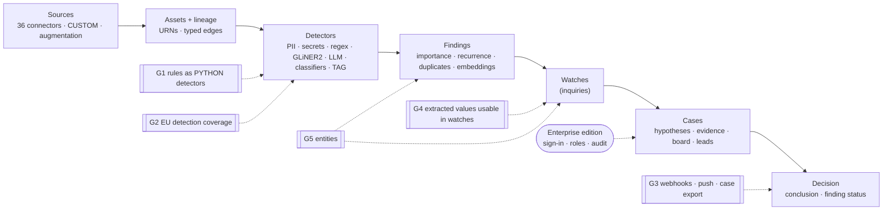

# Classifyre and the Palantir use cases: fit, gaps, and what to build

*Companion to [deep-research-report.md](deep-research-report.md). Checked against `develop` (v0.6.4-SNAPSHOT) on 2026-09-30. Every claim about Classifyre points to code or to a field report; see the evidence index at the end.*

**Scope.** This covers the open-source core (Apache-2.0), whose job is to build traction. Governance (sign-in, users and roles, audit, purpose limitation) is planned for an enterprise edition built when the first buyer arrives, so it is not counted as a gap. Where a sector needs governance, the verdict says **enterprise edition**. The target market is enterprises and government in Europe; §5 reads the findings through that lens.

**Implementation:** each gap has a PRD in [docs/prd/](docs/prd/README.md). [How the PRDs fit together](docs/prd/00-integration-architecture.md) covers the shared foundations, build order and end-to-end scenarios.

The goal is not to rebuild Palantir. The question is narrower: for each problem in the research, can Classifyre solve it today, which slice of it can it solve, and what is missing from the open-source core?

## The answer first

**Palantir's civilian cases are operational coordination.** They integrate live structured data, model a physical system (beds, aircraft, stores, networks), forecast and optimise, then write the decision back into ERP, EHR or field systems.

**Classifyre is evidence work.** It finds facts scattered across documents and records, connects them, substantiates a conclusion and keeps the trail.

The two overlap where a decision depends on evidence locked in documents. That overlap is where Classifyre should invest.

| | Sectors and problems | What it means |
|---|---|---|
| ✅ **Solves today** | Civil and corporate investigations; sensitive-data governance (where personal or secret data sits and how it flows); integrity checks and early warnings over public data; company-register research | Proven in the field: Enron, Epstein, Firmenbuch, GENESIS |
| 🟡 **Owns a slice** | KYC/AML investigations; supplier-communication and contract triage; quality and non-conformance investigations; ticket and complaint clustering; humanitarian record hygiene | The same few open-source gaps block all of them. Regulated buyers also need the enterprise edition |
| ❌ **Not a fit** | Hospital capacity; supply-chain planning; retail forecasting; predictive maintenance (energy, aviation); telecom network twins | The core is live telemetry plus forecasting and optimisation. That is Foundry's lane. Stay out of it |

**Where Classifyre helps.** Three conditions:
- The decision depends on evidence scattered across documents and records.
- The conclusion has to be defended, to an auditor, regulator, court or the public.
- The data can't leave the organisation.

The research's Palantir cases mostly meet only the first. The buyers that meet all three are compliance and internal-investigation teams, data-protection officers, security teams hunting leaked secrets, public-sector integrity and statistics offices, due-diligence and register researchers, and investigative journalists and NGOs.

In Europe, regulation (GDPR, NIS2, DORA, the AI Act, the Whistleblower Directive) turns that evidence work into recurring, budgeted demand (§5).

**Open-source gaps, in the order I'd close them for traction:**

1. **G1 · Rules live in connectors.** Every rule and quality check today is Python inside a CUSTOM or augmentation notebook, surfaced through TAG detectors. 67 of the 68 GENESIS detectors are TAG. A **PYTHON detector** is the right home. It covers checks, rules and bring-your-own-model. It does not cover cleaning, and it should not.
2. **G2 · European detection coverage.** Only 6 of the 27 member states have a dedicated national-ID recognizer. GDPR special categories (Art. 9) aren't detected as such. Detector definitions can't be shared between instances.
3. **G3 · Nothing leaves the app.** No webhooks, no push notifications, no case export. The decision stays inside Classifyre.
4. **G4 · Extracted values can't be used.** LLM and GLiNER2 output fields are stored per finding, but no search, watch, filter or export can test their value. The research's "unstructured contract → operational variable" step stops halfway.
5. **G5 · No entities.** Findings are strings. Nothing ties "ACME Holding GmbH" in an email to the ACME record from the register, or a person's name to their email and IBAN. Duplicates, weights and embeddings measure similarity; they don't establish identity.

Two smaller ones: **G6** a triage queue before a case, and **G7** outcome metrics.

**Enterprise edition, not a gap:** sign-in, roles, audit, reveal logging, purpose per case, and DSAR and SAR packs (§7).

**Before any of these:** make it hard to expose an instance without a login by accident (§6). That is deployment safety, not governance.

Forecasting, optimisation, streaming and write-back into operational systems stay out (§8).

---

## 1. The research's architecture, layer by layer

The research's generic Palantir pattern is: connectors → governed data → Ontology → rules/forecasts/ML → operational apps → decision → write-back. Here is Classifyre's version of that flow, with the open-source gaps marked.



| Research layer | Palantir | Classifyre today | Verdict |
|---|---|---|---|
| **Connect** | Batch, CDC, streaming, virtual tables; an agent proxy into private networks | 36 built-in connectors, CUSTOM Python connectors, augmentation on any source; runs inside the customer's network; scheduled or adaptive batch runs | ✅ |
| **Governed foundation** | Dataset versions, lineage, markings that follow the data | Per-run change facts (`RunnerAsset`), typed lineage edges (FLOW / CONTAINMENT / IDENTITY / REFERENCE / USAGE) with field mappings, URN stitching across sources | ✅ lineage · markings are enterprise edition |
| **Transform** | Pipelines produce new datasets | CUSTOM *derived sources*: `ctx.query_assets()` reads another source's assets and emits new record assets with FLOW/TRANSFORM edges | ✅ |
| **Ontology** | Typed objects, links, actions | Record assets with URNs, typed edges, the glossary, a reverse index of normalised values | 🟡 mentions aren't resolved to the things they mention (G5) |
| **Rules, models, AI** | Rules, forecasts, optimisation, custom models, AIP agents | Built-in detectors (SECRETS, PII, YARA, CODE_SECURITY, BROKEN_LINKS) and custom ones (REGEX, GLiNER2, LLM, text/image classification, object detection, TAG); importance ranking; embeddings; nine autopilot missions | ✅ text ML and agents · 🟡 rules only via TAG (G1) · ❌ forecasting and optimisation, by choice |
| **Operational apps** | Dashboards, maps, alerts, workflows | Watches; cases with hypotheses, evidence, board, chronology, leads, filters and escalations; dashboard; notifications | ✅ for investigation · ❌ maps |
| **Decision → action** | Approve, then write back to ERP/EHR/CRM | Conclusions, finding status and lead verdicts inside the app; CSV, live query, REST and MCP to pull data out | ❌ nothing is pushed (G3) |
| **Controls** | Roles, markings, purpose and audit, for humans and AI alike | Namespaces (a schema per tenant), encrypted secrets, MCP tokens scoped by tool group, autopilot observe-only mode with a decision log and undo | Enterprise edition (planned) |

## 2. What kind of data Classifyre is built for

This table explains most of the sector verdicts below. Where the research's principal data is documents and records, Classifyre fits. Where it is telemetry, transactions or live events, it doesn't.

| Principal data in the research | Examples | Classifyre |
|---|---|---|
| Documents, mail, chat, tickets, wikis | KYC files, supplier email, contracts, technician reports, case files, field messages | ✅ native |
| Registers and reference records | Company registers, sanctions lists, master data | ✅ CUSTOM record assets with URNs |
| Relational tables (snapshots) | Customer master, inventory, work orders | 🟡 scanned, but detectors see rendered text, not rows; rules need G1 |
| Transactions at volume | Payments, point of sale | ❌ not a transaction-monitoring engine |
| Telemetry, events, streams | SCADA, aircraft sensors, network alarms, admission events | ❌ |
| Imagery and geography | Satellite imagery, computer-vision detections, maps | 🟡 image models on files · ❌ geospatial |

## 3. Sector by sector

For each sector: the problem and principal data as the research states them, what Classifyre can do today, and what blocks the rest.

### Healthcare operations: ❌ core, 🟡 governance slice

- **Problem.** No live picture across EHR, bed, theatre and staffing systems. The aim is to forecast demand and rebalance beds and staff before the shift.
- **Principal data.** Admission, discharge and transfer events; census; rosters; theatre schedules. Structured and near-real-time.
- **Classifyre today.** Not the core problem. The slice it owns is governance: finding identifiable patient data where it should not be (exports on file shares, patient lists in tickets, chat and wikis) and showing how it flows. That is half of what an accurate DPIA needs. The research's NHS example is a DPIA whose description of access arrangements turned out to be wrong. The other half, who can reach the data, exists in the edge vocabulary (`OWNS`, `ACCESSED`), but no built-in connector emits it yet. Incident and complaint investigations fit as cases.
- **Blocked by.** The enterprise edition: patient data needs sign-in, roles and audit before anyone will point Classifyre at it. The open-source core can show the slice on synthetic data.

### Financial services (KYC, AML, investigations): 🟡

- **Problem.** The same customer lives in many systems, so onboarding is slow, alerts are duplicated and investigations drag. The aim is a single client view with an audit trail.
- **Principal data.** Customer master, KYC documents, transactions, sanctions and watch lists, ownership and counterparty relationships.
- **Classifyre today.** The investigation half:
  - KYC document extraction (LLM output fields, GLiNER2) and PII and identifier detection.
  - Cross-document recurrence of names, IBANs and emails (`get_value_occurrences`). This is the signal that carried the Enron case.
  - Cases with hypotheses, a chronology and lineage back to the source record.
  - Ownership data from registers through CUSTOM connectors, as the Firmenbuch source does.

  It does not do transaction monitoring. Payments at volume are not a document problem.
- **Blocked by.**
  - G5. The single client view is the core of Citi's result in the research.
  - Fuzzy sanctions and PEP screening. Regex can't do it; a PYTHON detector with the list loaded in `setup()` can (G1).
  - KYC fields can't be queried (G4).
  - No case export to build a suspicious-activity report from (G3).
  - Identity and audit: enterprise edition.

### Energy and utilities: ❌ core, ✅ security slice

- **Problem.** Detect faults and prioritise maintenance across SCADA, GIS, weather and imagery.
- **Principal data.** High-frequency telemetry, GIS, imagery.
- **Classifyre today.** Not the core. But the research's main security worry for this sector is SCADA credentials, plant topology and asset vulnerabilities, and those are exactly what leaks into wikis, tickets, repositories and shares. The SECRETS, CODE_SECURITY and YARA detectors over Confluence, Jira, Git and object storage find them today.
- **Blocked by.** Nothing worth building for the core.

### Manufacturing: ❌ production control, 🟡 defect investigations

- **Problem.** Decide which work comes next across schedules, parts, deliveries and defects; resolve defects; predict failures.
- **Principal data.** ERP, MES and BOM data; work orders; non-conformance records; telemetry; technician reports.
- **Classifyre today.** A non-conformance or root-cause investigation is a case: hypotheses marked SUPPORTED or REFUTED, evidence from reports, tickets and supplier mail, and a chronology. Custom detectors can catch IP leakage, such as process parameters or cost structures in the wrong place.
- **Blocked by.** Parts, batches and serial numbers as entities (G5); quality rules over tabular records (G1).

### Supply chain: ❌ planning, 🟡 supplier signals

- **Problem.** Plans and execution drift apart; shortages and disruptions need a coherent response.
- **Principal data.** ERP orders, inventory, forecasts, capacity, shipments; supplier emails and documents.
- **Classifyre today.** The unstructured signal the research credits to AIP. The Email, Microsoft 365 and Google Workspace connectors plus an LLM detector with labels (delay, force majeure, price change) and output fields (PO number, new date, quantity).
- **Blocked by.**
  - An output field can't drive a watch: "delay over 7 days on a critical PO" is not expressible (G4).
  - Nothing reaches the planner (G3).
  - Signals aren't grouped per supplier (G5).

### Transportation and aviation: ❌

- **Problem.** Predict faults and plan maintenance from telemetry and maintenance history.
- **Principal data.** Aircraft sensors, fault messages, maintenance and engineering records.
- **Classifyre today.** Maintenance logs and engineering documents become searchable. Little more.
- **Blocked by.** Not worth pursuing.

### Telecommunications: ❌ network twin, 🟡 tickets

- **Problem.** Trace a complaint to the network elements behind it, find the root cause, prioritise replacement.
- **Principal data.** Topology, telemetry, alarms, quality-of-service metrics, tickets, field work.
- **Classifyre today.** ServiceDesk and Jira tickets, grouped by the duplicates engine and by semantic search, show recurring complaints. PII detection gives evidence for the research's advice to keep subscriber data away from engineers.
- **Blocked by.** Linking a ticket to a network element needs topology and telemetry. Not our lane.

### Retail: ❌ forecasting, 🟡 contracts

- **Problem.** Store and SKU decisions under promotions, inventory and weather; in returns, checking supplier contract terms against return flows.
- **Principal data.** Point of sale, SKU, inventory, promotions, weather, competitor prices; supplier contracts.
- **Classifyre today.** LLM output fields can turn thousands of supplier contracts into variables: return window, restocking fee, penalty.
- **Blocked by.** The variables can't be queried or compared (G4). Checking terms against the returns table is a rule (G1).

### Law enforcement and civil investigations: ✅ closest fit

- **Problem.** Pull evidence and entities from many systems into one case record and relationship graph, without exposing every dataset to every investigator.
- **Principal data.** Case files, identity and organisation records, financial and trade records, documents, media, locations.
- **Classifyre today.** This is the product's shape:
  - Cases led by hypotheses, with evidence that has lineage back to its source.
  - The case board and a chronology.
  - Leads from four origins: semantic neighbours, duplicates, watch answers and autopilot proposals.
  - Standing watches that auto-pull new matches into cases.
  - Cross-document recurrence, and a glossary of people, organisations and places.
  - Media extraction, image and object models, and MCP for agent-assisted work.

  Proven on the Enron, Epstein and Firmenbuch corpora.
- **Blocked by.**
  - The enterprise edition: need-to-know access, real identities in the audit trail, and a recorded purpose per case. That last one is the research's proportionality point.
  - G5: entities as first-class nodes.
  - G3: a disclosure or export pack.
  - Maps.
- **Positioning.** In Europe, police data analysis is the most legally constrained market (§5). Lead with civil and corporate investigations: compliance, audit, fraud, due diligence, journalism, public registers.

### Humanitarian aid and disaster response: ❌ logistics, 🟡 records

- **Problem.** Allocate scarce aid while information changes; coordinate organisations without losing track of vulnerable people.
- **Principal data.** Procurement, shipments, beneficiary records, NGO systems, messaging, geospatial data.
- **Classifyre today.** PII minimisation across partner data; LLM triage of field messages (need, place, urgency); the all-in-one Docker image runs where data can't leave.
- **Blocked by.** Deduplicating beneficiaries across NGO records is entity resolution (G5). Access control by role and location, which the research says the Noto deployment needed, is enterprise edition. Maps.

## 4. Your hypotheses, checked

### 4.1 "Ingestion is well covered": agree

36 built-in connectors, CUSTOM and augmentation cover documents, collaboration tools, mail, object stores, relational databases, lakehouse tables, search engines, registers, and anything that has a Python library. Against the research's connection list:

| Research | Classifyre |
|---|---|
| Batch sync, APIs | ✅ |
| Private networks (Palantir's agent proxy) | ✅ by design: Classifyre runs inside the customer's network |
| Documents and media | ✅ PDFs, office formats, mail files, images, archives as child assets |
| CDC, streaming, virtual tables | ❌ runs are scheduled or adaptive (`CRON`/`AUTO`); Kafka is read per run through its REST proxy |

The ❌ row doesn't matter for evidence work. Two limits do matter later:

- Detectors receive page text. A table arrives as rendered text, not rows.
- Nothing writes back to a source.

### 4.2 "A Python detector would cover cleaning and quality checks": yes for checks, no for cleaning

"Cleaning" hides three different jobs:

| Job | What it does | Where it lives today | Where it should live |
|---|---|---|---|
| **Transform / clean** | Produce a better dataset for the next step | A CUSTOM **derived source**: `ctx.query_assets()` reads another source's assets and emits new record assets with FLOW/TRANSFORM edges (GENESIS *Kreisprofile*) | Stays there |
| **Enrich** | Add an attribute: a normalised name, a category, a URN | Augmentation `asset.set()` and `set_urn()`; LLM and GLiNER2 output fields | Stays there |
| **Check / rule** | Judge data against an expectation and raise a finding | Python in a connector or augmentation notebook → `tags={...}` → TAG detector | **PYTHON detector** |

So the capability exists. For checks, it sits in the wrong place. The GENESIS build proves it: 67 TAG detectors and one regex, and the field report's own review says the corpus "exercises ingestion and casework but not the detection engine". Three platform fixes were symptoms of rules living in connectors:

- **P4:** a check that stopped firing never resolved its finding.
- **P6:** templated tag values flooded duplicate review with 3,556 pairs, none of them duplicates.
- **P9:** one severity per TAG detector meant two detectors per rule.

Other costs have no P-number but remain:

- An augmentation notebook belongs to one source, so the same rule is copied into every source that needs it.
- Changing a rule means re-scanning the source.
- A TAG gives one finding per key per asset, with no location. Which row? Which page?
- Test scenarios, training, false-positive feedback and the per-detector scan cache don't apply to rules.

**The PYTHON detector** is a new pipeline type next to REGEX, GLINER2, LLM and TAG, attachable to any source:

```python
def setup(ctx):                    # once per run: reference data, a list, a model
    ctx.state["codes"] = load_codes(ctx.file("reference.csv"))

def detect(asset, ctx):            # once per asset, with the augmentation readers
    for i, row in enumerate(asset.rows()):
        parts = sum(row[c] for c in ctx.state["codes"])
        if row["total"] != parts:
            yield Finding(
                label="total_mismatch",
                value=f"{row['total']} != {parts}",
                location={"row": i, "column": "total"},
                severity="HIGH",   # capped by the detector's severity, like Tag
                extracted={"expected": parts, "actual": row["total"]},
            )
```

Reuse what exists rather than rebuild it:

- The notebook child process, package installation, secrets and credential isolation from CUSTOM and augmentation.
- The augmentation readers (`rows()`, `payload()`, `text()`, `pages()`, metadata). Detectors would finally see rows.
- `DetectorScope` and `DetectorBudget`, and the per-detector scan cache keyed on the code's hash.
- Test scenarios (they will need an asset-shaped fixture, not only `inputText`), false-positive feedback and the Tag severity ceiling.
- A `normalized_value` on the finding, so it takes part in recurrence and later in entities (G5).

Keep TAG for facts the source system already asserts, such as a register saying "insolvent". Move computed checks (`de_dq_*`, `de_land_alert_*`) to PYTHON detectors. The PYTHON detector also lets users add a national ID we don't ship yet. The IDs we do ship (G2) are built into the PII detector, so they don't wait for G1.

Watch out for:

- **Noise.** Both first-use retrospectives found the bottleneck is judgment, not extraction, and every new rule adds findings. Require a passing test scenario before a rule goes live, and show its precision from reviewer verdicts.
- **Determinism.** A rule that calls an external API breaks the scan cache. Let the author declare that, and skip caching for it.
- **Scope creep.** Version 1 judges one asset at a time. Corpus-wide comparisons, such as a district against all districts, stay in derived sources, or later move to a `finalize()` like the one augmentation has.

What it does not do is rewrite content. A detector judges; it doesn't change what the connector extracted. Augmentation already enforces the same additive-only rule.

### 4.3 "Cases and inquiries are the operational apps, but the steps between are missing": partly

More of the middle exists than it seems:

> finding → watch match (NEW or GONE per run) → `inquiry.new_matches` notification → auto-pull into linked cases → case filters (EXCLUDE) and escalations (ESCALATE) → leads inbox (semantic neighbours, duplicates, watch answers, autopilot) → the ESCALATION agent notifies on high-severity cases

What is missing:

1. **Watches can't express rules.** A watch matches on source, detector, finding type and a value regex, and nothing else. It can't say:
   - extracted `delay_days` > 7
   - asset metadata `doc_type` = contract
   - severity ≥ HIGH, or importance ≥ 0.7
   - an IBAN and a sanctions hit on the same asset
   - a value seen in 3 or more sources
   - 20 or more new matches this week

   Those are the rules the research's sectors run. Add them as matcher predicates, using the `eq / in / exists / gt / gte / lt / lte` vocabulary that `ctx.query_assets` already speaks.
2. **Extracted values can't be queried.** `search_extractions` filters by detector, source and asset only, and output fields sit in JSONB payloads keyed by hash. Promote them into a typed side table (finding, field, text, number, date) so that search, watches, filters, CSV and live query can all use them. The PYTHON detector's `extracted` output writes to the same table.
3. **No triage before a case.** Leads belong to a case. An AML- or QA-style queue needs the same thing workspace-wide: proposed → accepted (into a new case or an existing one) → dismissed and remembered. That is `CaseLead` without a case. It is also the "alerts" that Phase 3 of the investigation roadmap described and never built.
4. **Nothing goes out** (§4.6).
5. **Assignment is free text.** Ownership, queues and SLAs need identity, which is enterprise edition.

### 4.4 "Duplicates, weights and embeddings: do they cover the ontology?": they fit the flow, but they're the wrong unit

What exists:

| Mechanism | Unit | Answers |
|---|---|---|
| Duplicates engine (weighted value overlap, review queue, verdicts, patterns, clusters) | Document ↔ document | "Is this the same document, or a close copy?" |
| Embeddings (neighbours, hybrid search, semantic leads) | Text ↔ text | "What talks about the same thing?" |
| Reverse index of normalised values, exact and phonetic (`get_value_occurrences`) | String | "Where else does this exact value appear?" The most defensible signal in the Enron run |
| Record assets with URNs, plus IDENTITY/`same_as` edges | Record | "This row in source A is that row in source B." Firmenbuch companies and GENESIS regions; cross-source stitching held in every direction |
| Glossary (type, aliases, operator-gated proposed aliases, semantic lookup) | Canonical term | "What do we call this, and what else is it called?" |

These fit the flow: duplicates and neighbours feed the leads inbox, and recurrence feeds watches and cases. The gap is the unit the flow pivots on. It is always a document or a string, never the thing. The mention "ACME Holding GmbH" in an email, the Firmenbuch record for ACME, the glossary term "ACME" and the value `ATU12345678` are four unconnected objects.

The missing bridge is **mention → entity**, and it can grow out of the glossary instead of becoming a new platform:

- The glossary term becomes the entity. It already has a type (person, organisation, location, …), aliases, operator-gated proposals, embeddings, verification and polymorphic references.
- Add mentions: a normalised value (`valueHash`) → an entity, with a method (exact alias, URN, phonetic, semantic, manual) and a verdict.
- Auto-link exact aliases and URNs. Send phonetic and semantic candidates to a review queue that reuses the duplicate-review UX. Never merge two entities automatically.
- Surfaces:
  - An entity page: mentions over time, assets, sources, cases, co-mentioned entities.
  - The entity as case evidence and as a board node.
  - A watch for "anything new about this entity".
  - Co-mention edges, and connectors emitting edges to entity URNs (director of, shareholder of).
- Resolve only identifier-like and name-like labels. P6 showed what correlating templated values does.

This is ontology-lite: typed things, their mentions and their links. No object-type schemas, functions or actions. The roadmap's Phase 4 "data concepts" are a different axis: they group assets by the kind of data they hold (Customer Data), while entities group mentions by the thing they refer to (ACME). Both fit the polymorphic `edges` table.

On "digital twin": Classifyre's twin is the **information estate**: what data exists, where it is, how it flows and what it says. That is already built. Don't model beds, aircraft or pipes.

### 4.5 "Rules, optimisation, forecasting, ML: not yet": agree, with one correction

Most "rules" and "custom ML" in the research are "flag when X" and "run my model on this". The PYTHON detector plus watch predicates cover both. Existing ML already covers a lot: a trainable text classifier with training runs and metrics, GLiNER2 zero-shot entities and classification, LLM labels and fields, image classification and object detection. Simple trend thresholds work today; GENESIS flags +30 % year on year as HIGH from a notebook.

What stays out: demand forecasting, capacity planning, route and basket optimisation, and anomaly detection on telemetry. The research's biggest numbers come from these, and they are Foundry-shaped.

### 4.6 "Dashboards and alerts are embedded in the case": the right home, with two holes

What exists:

- Escalated cases rise to the top of the case list.
- The dashboard shows casework and leads awaiting review.
- Discovery shows finding totals by severity and status, recent activity (today, week, month) and a connections canvas.
- Findings charts cover 7, 30 and 90 days.
- Notifications are in-app, and the ESCALATION agent raises them for high-severity cases.

The holes:

- **Alerts don't leave the app.** No email, no Slack or Teams push, no webhook. The Telegram and Slack bots answer questions; they don't push. The research's adoption lesson is to put the decision where people already work.
- **A case can't leave either.** There is no export for a regulator, a board, a court or a data-protection officer. Phase 8 of the investigation roadmap lists it; it isn't built.

Don't build a dashboard builder or maps. Live query already feeds Excel and Power BI.

## 5. Europe: enterprises and government

European regulation creates recurring demand for evidence work: someone has to be able to show what data exists, where it is, and what was done about it. That is Classifyre's shape, and the open-source core already covers much of it.

| EU need (who has it) | Open-source core today | Gap |
|---|---|---|
| **GDPR records of processing and DPIAs** (Art. 30, 35): every controller; data-protection officers | PII findings per source and category; lineage showing where data flows; recurrence across sources | Special categories (Art. 9: health, ethnic origin, political opinion, religion or belief, trade-union membership, sex life or orientation, genetic, biometric) aren't detected as such. Dedicated national-ID recognizers exist for 6 of the 27 member states (AT, DE, ES, FI, IT, PL). France, the Netherlands, Belgium, Sweden, Denmark, Portugal, Ireland and most of central and eastern Europe have none (G2) |
| **GDPR access and erasure requests** (Art. 15, 17) | `get_value_occurrences` finds every asset that holds an exact email, IBAN or ID number | One person under several spellings needs entities (G5). The answer needs an export (G3). Deadlines and the response workflow are enterprise edition |
| **NIS2 and DORA** security hygiene | SECRETS, CODE_SECURITY and YARA over wikis, tickets, repositories, chat and file shares | — |
| **AI Act Art. 10**: data governance for the training, validation and test data of high-risk systems | Hugging Face, lakehouse and database sources; PII detection; classifiers | Quality and bias checks on datasets are rules (G1) |
| **Whistleblower Directive**: follow-up on internal reports | Cases with hypotheses, evidence and chronology | Keeping the reporter's identity confidential is enterprise governance |
| **EU AML package** (AMLR, AMLA) | The investigation slice from §3 | Entities (G5), list screening (G1), SAR export (G3) |
| **Official statistics, registers, transparency** | Proven on GENESIS (Destatis) and Firmenbuch | Integrity checks move out of notebooks into PYTHON detectors (G1) |
| **Police data analysis** | The product's shape fits (§3) | In 2023 Germany's Federal Constitutional Court ruled that Hesse's and Hamburg's provisions for automated police data analysis were unconstitutional as written; Hesse's system runs on Palantir. The market is legally constrained and politically contested. It needs the enterprise edition and legal review first. Don't lead with it |

**What already sells in Europe:**

- **Apache-2.0 and self-hosted**, on Kubernetes or as one Docker image, so data never leaves the customer. The research notes that Palantir itself sells a "Europa" variant of Gotham to sovereignty-sensitive customers. Sovereignty is a buying criterion.
- **Local AI.** OpenAI-compatible providers cover locally hosted models, and the Docker image ships its embedding model, so semantic search works offline.
- **German UI** and DACH starter detectors: regulatory entities, contract risk, German invoice PII.
- **135 MCP tools**, so a customer's own AI agents can drive it.
- **Public-data showcases** (Firmenbuch, GENESIS, Enron, Epstein). They prove value without touching anyone's private data, which is the right way to build traction before governance exists.

One channel note from outside the code: openCode.de is the German public sector's platform for publishing and finding open-source software. Listing the core there puts it in front of that audience.

## 6. What to build in the open-source core, in order

**First, safe defaults (extra small).** The core has no sign-in, and for now that is fine. But a Classifyre instance lists every secret and identifier it has found, and the Docker guide doesn't mention that anyone who can reach port 3000 can use it. Do three things:
- Document an auth-proxy recipe for the Helm chart (its ingresses already accept annotations) and for Docker.
- Say plainly, on first run and in the docs, that the instance has no login.
- Put a line in the README.

This is deployment safety, not governance. An exposed instance on the internet would be a bad first headline for an open-source project.

| # | Build | Smallest version that closes the gap | Reuses | Why it drives traction | Size |
|---|---|---|---|---|---|
| **G1** | PYTHON detector | As in §4.2 | Notebook runtime, augmentation readers, scope and budget, scan cache, test scenarios, the Tag severity ceiling | Extensibility is what open-source users build on and contribute to. Rules and quality checks become reusable; list screening and bring-your-own-model come with it | M |
| **G2** | European detection coverage | National-ID detectors with checksum validation for the missing member states; EU VAT numbers; Art. 9 special categories as starter detectors (LLM or GLiNER2); export and import of detector definitions as files | The PII detector's recognizer registry, the starter-example catalogue, custom-detector JSON | A French, Dutch or Nordic evaluator's first scan finds their own ID numbers. The data-protection-officer use case works across the EU. The community can contribute country packs | S–M |
| **G3** | Things leave the app | Signed webhooks with retry on domain events (new watch matches, escalation, case status change, lead proposed). Push through the existing Slack and Telegram connectors, plus email. Case export as Markdown and JSON | Chat-gateway connectors, the case timeline | Technical adopters expect webhooks, and exported cases get shared. Tickets flow through the customer's own automation instead of N write-back connectors | S–M |
| **G4** | Usable extracted values and watch predicates | A typed side table for output fields; predicates on watches, case filters and search; the fields as CSV and live-query columns | The `query_assets` predicate vocabulary; the matcher SQL conformance tests | Makes LLM extraction demo-able end to end: "extract contract terms, then watch for penalties over 5 %" | M |
| **G5** | Entities | As in §4.4 | Glossary, correlation values, duplicate-review UX, polymorphic edges and evidence | The strongest demo: one page for a company or person across every source. Also the base of an access-request answer | L |
| **G6** | Workspace triage queue | `CaseLead` without a case, fed by watches flagged as queues | The leads model and UI | AML- and QA-style queues | S–M, after G4 |
| **G7** | Outcome metrics | Time to triage, attach and close; precision per detector from verdicts; lead acceptance by origin; watch hit rate | Finding history, case activity, lead status, detector feedback | Adopters can publish measured results, which are the case studies that later sell the enterprise edition | S |

Notes on sequencing:

- G1 comes first: it is the capability you asked about. G2's recognizers and Art. 9 detectors don't depend on it and can be built alongside it.
- G3 is small; build it alongside G1.
- G1 and G4 share a table: the PYTHON detector's `extracted` output lands in G4's table.
- G5 is the largest. Start it once G1–G4 are out. If the public investigation showcases are the traction engine, pull it forward: it upgrades recurrence, the signal that already works best.

## 7. Enterprise edition: what waits for a buyer, and how to keep it cheap

| Enterprise edition | Why it waits for a buyer |
|---|---|
| Sign-in (OIDC or SAML), users, roles per namespace | A buyer's requirement, not an evaluator's |
| Real actors on every activity row; audit export | Today actors are self-declared (`X-Actor-Name`) |
| Matched content redacted by role (`redactedContent` already exists), with every reveal logged | The research's key control |
| A purpose or legal basis per case, with review dates | Proportionality: the research's point, and the German court's |
| DSAR and SAR response packs with deadlines | A compliance workflow on top of G3 and G5 |
| Sensitivity markings that follow FLOW lineage | The edge-class design already separates the edges a marking should travel through from the ones it shouldn't |
| Reporter confidentiality for whistleblowing cases | A Directive requirement |

**Keep it a module, not a fork.** You plan to fork when a buyer arrives. The core moves fast:
- `schema.prisma` is one 3,590-line file.
- 206 migrations run against every tenant schema.
- September alone had 193 commits.

In a long-lived fork, every upstream schema change becomes a merge. Worse, Prisma's `migrate deploy` doesn't re-check a migration it has already applied. Resolving a merge conflict inside one therefore drifts every tenant schema without any error.

The cheaper route is to add three small seams to the core now. They implement no governance; they are only places to plug it in:
1. An actor resolver. Today `@ActorName()` reads the `X-Actor-Name` header.
2. An authorisation hook that allows everything by default.
3. An event emitted whenever someone reveals matched content.

The enterprise edition then ships as its own module, with its own tables and migrations, loaded by the same app.

## 8. What not to build

- Forecasting, capacity planning, and optimisation of routes, baskets, promotions or staffing.
- Streaming, CDC or virtual tables.
- Write-back into ERP, EHR, SCADA or CRM. Webhooks hand the decision off, and the customer's automation acts on it.
- Physical digital twins, time-series analytics, or anomaly detection on telemetry.
- A dashboard builder. Live query already feeds BI tools.
- Maps, unless humanitarian or disaster response becomes a target.
- A transform or pipeline engine. Derived sources already are one.
- A full ontology with object types, functions and actions.

## 9. Evidence index

| Claim | Where |
|---|---|
| 36 built-in connectors plus CUSTOM and SANDBOX | [all_input_sources.json](packages/schemas/src/schemas/all_input_sources.json) (38 `*Input` types), [apps/cli/src/sources](apps/cli/src/sources) |
| CUSTOM SDK: `Asset`, `Tag`, `query_assets` and derived sources | [apps/cli/src/notebook/sdk.py](apps/cli/src/notebook/sdk.py) |
| Augmentation is per-source, additive-only, and runs between extraction and detection | [apps/cli/src/augmentation/sdk.py](apps/cli/src/augmentation/sdk.py), `AugmentationConfig` in `all_input_sources.json` |
| Detector engines, TAG, LLM output fields, `DetectorScope` | [all_detectors.json](packages/schemas/src/schemas/all_detectors.json), [apps/cli/src/detectors/custom/runners](apps/cli/src/detectors/custom/runners) |
| 41 PII recognizers; national IDs for AT, DE, ES, FI, IT, PL (plus CH, UK NHS, generic `EU_NATIONAL_ID`); no Art. 9 category | `PIIEnabledPattern` in [all_detectors.json](packages/schemas/src/schemas/all_detectors.json), [apps/cli/src/detectors/pii/detector.py](apps/cli/src/detectors/pii/detector.py) |
| 28 custom-detector starter examples, including DACH ones; no import or export of detector definitions | `CUSTOM` in [all_detectors_examples.json](packages/schemas/src/schemas/all_detectors_examples.json), [custom-detectors.controller.ts](apps/api/src/controllers/custom-detectors.controller.ts) |
| Detectors receive text or bytes, not rows | [apps/cli/src/detectors/base.py](apps/cli/src/detectors/base.py), [detector_pipeline.py](apps/cli/src/pipeline/detector_pipeline.py) |
| Extractions searchable by detector, source and asset only | [custom-detector-extractions.service.ts](apps/api/src/custom-detector-extractions.service.ts) (`search`) |
| Findings, correlation values, edges, cases, leads, filters, inquiries, glossary, autopilot kinds, `aiMode` | [schema.prisma](apps/api/prisma/schema.prisma) |
| No user model; actor names are attribution only | [actor-name.decorator.ts](apps/api/src/actor-name.decorator.ts); the `internalApiKey` comment in [values.yaml](helm/classifyre/values.yaml); [CASE_BOARD_PRD.md](docs/architecture/CASE_BOARD_PRD.md) §5.12 |
| Ingress annotations available; Docker guide silent on sign-in | [helm/classifyre/templates](helm/classifyre/templates) (`ingress-*.yaml`), [deployment/docker](apps/docs/app/deployment/docker/page.mdx) |
| 135 MCP tools | `registerTool(` in [mcp-server.factory.ts](apps/api/src/mcp-server.factory.ts) |
| CSV and live-query exports | [apps/api/src/export](apps/api/src/export) |
| Built-in connectors emit no ownership or access edges yet | `UsageType` in [edges.py](apps/cli/src/graph/edges.py); no emitters under `apps/cli/src/sources` |
| GENESIS: 67 TAG + 1 REGEX; P4, P6, P9; "not the detection engine" | [GENESIS_FIELD_REPORT.md](docs/architecture/GENESIS_FIELD_REPORT.md), [genesis/NAMESPACE_PLAN.md](genesis/NAMESPACE_PLAN.md) |
| Recurrence is the most defensible signal; judgment is the bottleneck | [Enron product evaluation](docs/first-use/enron-second-attempt/product-evaluation.md), [Epstein retrospective](docs/first-use/epstein-retrospective-blunt.md) |
| Alerts (Phase 3), data concepts (Phase 4), identity and case export (Phase 8) not built | [INVESTIGATION_ROADMAP.md](docs/architecture/INVESTIGATION_ROADMAP.md) |
| Apache-2.0 | [LICENSE](LICENSE) |
